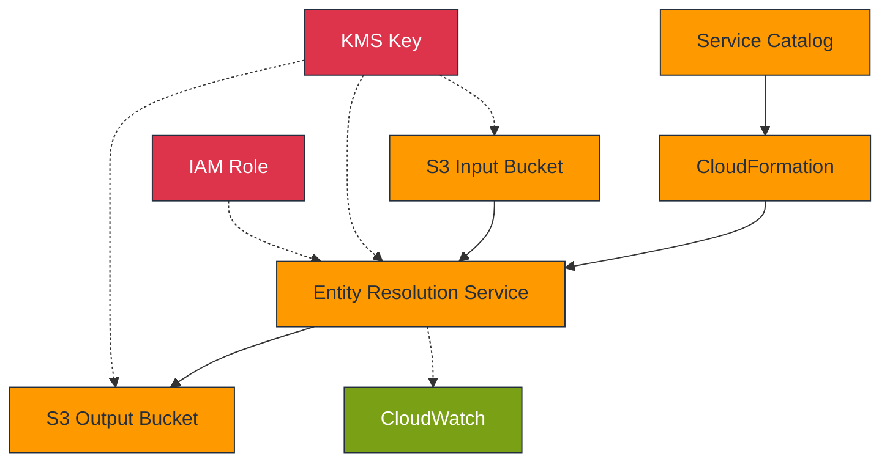

# AWS Entity Resolution - Service Catalog Product

## Overview

A Service Catalog product that enables standardized deployment of AWS Entity Resolution
for matching records across datasets without sharing identifier data. This solution
implements consistent security controls, governance, and deployment patterns through
Infrastructure as Code.

## Business Value

| Benefit           | Description                                  | Impact                       |
| ----------------- | -------------------------------------------- | ---------------------------- |
| Deployment Speed  | Pre-configured templates with best practices | 70% faster implementation    |
| Standardization   | Consistent implementation patterns           | Reduced operational overhead |
| Governance        | Centralized management with access controls  | Improved compliance          |
| Cost Optimization | Reduced development and management effort    | Lower TCO                    |

## Architecture



## Core Components

### Entity Resolution Resources

- **Matching Workflows**: Configurable rule-based matching
- **Schema Mappings**: Field standardization configuration
- **ID Mapping Tables**: Entity relationship storage

### Infrastructure Resources

- **S3 Buckets**: Input data and output results storage
- **KMS Key**: Single encryption key for all data
- **IAM Roles**: Least-privilege access control

## Implementation Requirements

### Prerequisites

- AWS Service Catalog access
- Permission to create CloudFormation stacks
- Data in compatible format (CSV/JSON)

### Data Requirements

- Properly formatted customer/entity data
- Fields must align with schema mapping configuration
- S3 bucket access for input and output data

## Security Essentials

The primary security requirement is KMS integration:

```yaml
# Required KMS permissions for Entity Resolution
Statement:
  - Effect: Allow
    Principal:
      Service: "entityresolution.amazonaws.com"
    Action:
      - "kms:Encrypt"
      - "kms:Decrypt"
      - "kms:ReEncrypt*"
      - "kms:GenerateDataKey*"
      - "kms:DescribeKey"
    Resource: "*"
```

## Deployment Process

1. Access Service Catalog and select the Entity Resolution product
1. Configure CloudFormation parameters for your use case
1. Provision and deploy resources
1. Upload data to input S3 bucket
1. Configure and execute matching workflows
1. Access matching results in output S3 bucket

## Documentation Guide

| Document                                       | Purpose                              |
| ---------------------------------------------- | ------------------------------------ |
| [Implementation Guide](implementation-plan.md) | Step-by-step deployment instructions |
| [Architecture Document](architecture.md)       | Technical architecture details       |
| [Security Guide](security-considerations.md)   | Security configuration requirements  |

## Troubleshooting

| Issue              | Resolution                                               |
| ------------------ | -------------------------------------------------------- |
| KMS Access Denied  | Verify Entity Resolution service principal in key policy |
| Workflow Failure   | Confirm data format matches schema configuration         |
| Missing Results    | Check S3 permissions and bucket encryption settings      |
| Performance Issues | Evaluate data volume and workflow configuration          |

## Implementation Challenges

Based on customer feedback, this section outlines common challenges and recommended
mitigation strategies:

### Known Limitations and Mitigations

| Challenge                  | Description                                                                    | Mitigation Strategy                                                                                        |
| -------------------------- | ------------------------------------------------------------------------------ | ---------------------------------------------------------------------------------------------------------- |
| **Matching Flexibility**   | Exact matching rules may be too rigid for real-world data with variations      | Use composite rules that combine multiple fields; consider data standardization before ingestion           |
| **Data Preparation**       | Strict formatting requirements create additional work                          | Develop pre-processing scripts for data standardization; use schema mapping templates provided             |
| **Result Quality**         | False positives requiring manual review; missed matches due to data variations | Implement a phased approach: start with strict rules, then gradually adjust based on results analysis      |
| **Operational Visibility** | Limited visibility into matching process and decision factors                  | Use CloudWatch logs for workflow monitoring; implement additional operational metrics via CloudWatch       |
| **Throughput Constraints** | Processing limitations for large datasets                                      | Partition large datasets into smaller batches; implement parallel processing of multiple workflows         |
| **Integration Challenges** | Difficulty incorporating into existing data flows                              | Use AWS Step Functions to orchestrate end-to-end workflows; implement pre/post-processing Lambda functions |
| **Measuring Success**      | Hard to quantify value and match quality                                       | Establish baseline metrics before implementation; test with known datasets to evaluate accuracy            |

### Recommended Enhancement Roadmap

For enterprise implementations, consider these enhancements beyond the base template:

1. **Pre/Post Processing**: Lambda functions for data standardization and results
   processing
1. **Quality Control**: Implement match confidence scoring and threshold filtering
1. **Workflow Orchestration**: Use Step Functions to create end-to-end matching
   pipelines
1. **Custom Monitoring**: Enhanced CloudWatch dashboards for match quality metrics
1. **Feedback Loop**: Process to capture false positives/negatives for rule refinement
