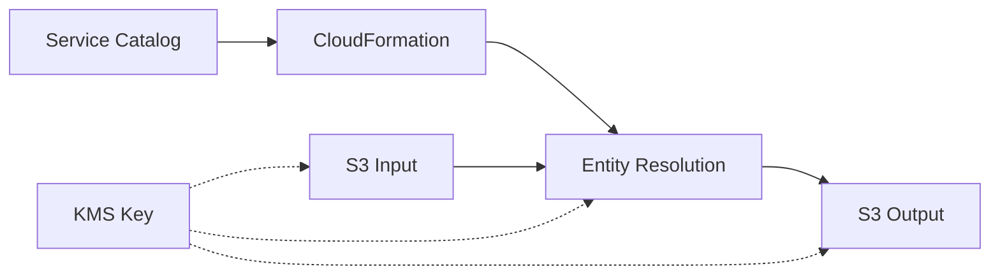

# AWS Entity Resolution - Service Catalog Product

## Overview

This Service Catalog product provides a streamlined way to implement AWS Entity
Resolution workflows for matching records across datasets without sharing identifier
data. It enables organizations to deploy entity resolution capabilities with consistent
security controls, governance, and deployment patterns.

## Key Benefits

- **Time Savings**: Deploy entity resolution workflows in hours instead of weeks
- **Standardization**: Consistent implementation with security best practices
- **Governance**: Centralized management with proper access controls
- **Efficiency**: Reduced operational overhead and maintenance costs
- **Scalability**: Designed for enterprise-scale data matching needs

## Architecture



## Implementation Requirements

### Critical Requirements

1. **S3 Buckets**: Separate input and output S3 buckets for data storage
1. **Data Format**: Input data must be in a format compatible with Entity Resolution
   (CSV/JSON)
1. **Security**: A single KMS key for encrypting all data at rest

### CloudFormation Template Components

- **Entity Resolution Resources**

  - Matching workflows with configurable parameters
  - Schema mappings for standardized data formats
  - ID mapping tables for entity relationships

- **Infrastructure Resources**

  - S3 buckets for data storage and results
  - KMS key for encryption

- **Supporting Resources**

  - IAM roles with proper permissions
  - CloudWatch monitoring and logging

### Resource Configuration Example

```yaml
# KMS Key for Encryption
DataEncryptionKey:
  Type: AWS::KMS::Key
  Properties:
    Description: "KMS key for Entity Resolution data"
    EnableKeyRotation: true
    KeyPolicy:
      # Key policy details...

# S3 Bucket for Input Data
InputBucket:
  Type: AWS::S3::Bucket
  Properties:
    BucketEncryption:
      ServerSideEncryptionConfiguration:
        - ServerSideEncryptionByDefault:
            SSEAlgorithm: aws:kms
            KMSMasterKeyID: !GetAtt DataEncryptionKey.Arn

# S3 Bucket for Output Data
OutputBucket:
  Type: AWS::S3::Bucket
  Properties:
    BucketEncryption:
      ServerSideEncryptionConfiguration:
        - ServerSideEncryptionByDefault:
            SSEAlgorithm: aws:kms
            KMSMasterKeyID: !GetAtt DataEncryptionKey.Arn

# Entity Resolution Workflow
EntityResolutionWorkflow:
  Type: AWS::EntityResolution::MatchingWorkflow
  Properties:
    Description: "Customer matching workflow"
    InputSourceConfig:
      InputSourceARN: !Sub "arn:aws:s3:::${InputBucket}/customer-data/"
    OutputSourceConfig:
      OutputS3Path: !Sub "s3://${OutputBucket}/matching-results/"
      KMSArn: !GetAtt DataEncryptionKey.Arn
```

## Security Considerations

The only security requirement for AWS Entity Resolution is KMS integration:

- **KMS Access**: Entity Resolution service requires access to your KMS key to decrypt
  your data and encrypt results
- **Key Policy**: Ensure your KMS key policy includes permissions for the
  entityresolution.amazonaws.com service principal
- **Testing**: Verify KMS access works by testing a small workflow before full
  implementation

For an example key policy configuration, see the
[Security Guide](security-considerations.md).

## Deployment Process

1. Request the Service Catalog product from your administrator
1. Customize the CloudFormation parameters for your use case
1. Define your S3 buckets and KMS key in the template
1. Launch the product through Service Catalog
1. Upload your data to your S3 input bucket
1. Configure and run your matching workflows
1. Access matching results in your output bucket

## Documentation Structure

This README provides an overview of the AWS Entity Resolution Service Catalog product.
For details:

| Document                                       | Purpose                                                        |
| ---------------------------------------------- | -------------------------------------------------------------- |
| [Implementation Guide](implementation-plan.md) | Step-by-step implementation process and resource configuration |
| [Architecture Document](architecture.md)       | Simplified technical architecture                              |
| [Security Guide](security-considerations.md)   | KMS integration requirements                                   |

We've simplified documentation to focus on essential requirements.

### Documentation Quality Tools

This repository uses pre-commit hooks to ensure high-quality documentation:

- **Markdown Linting**: Enforces consistent styling and formatting
- **Automated Formatting**: Maintains consistent document formatting

To use these tools:

```bash
pip install pre-commit
pre-commit install
```

Or run the validation script:

```bash
./validate-docs.sh
```

## Development

### Mermaid Diagrams

This project uses Mermaid for creating diagrams in markdown files:

1. **Pre-commit Hook**: Mermaid diagrams are automatically checked before commits
1. **Live Editor**: Use [Mermaid Live Editor](https://mermaid.live/) to test diagrams
   before adding them

To fix a diagram, check the error message from the pre-commit hook and make the
necessary corrections.

## Troubleshooting

Common issues and solutions:

- **Access Denied Errors**: Check IAM roles and KMS key policies
- **Data Format Issues**: Ensure your S3 data is in a compatible format (CSV/JSON)
- **Entity Resolution Workflow Failures**: Verify schema mappings match your data format
- **Performance Issues**: Check for data volume constraints or throttling
