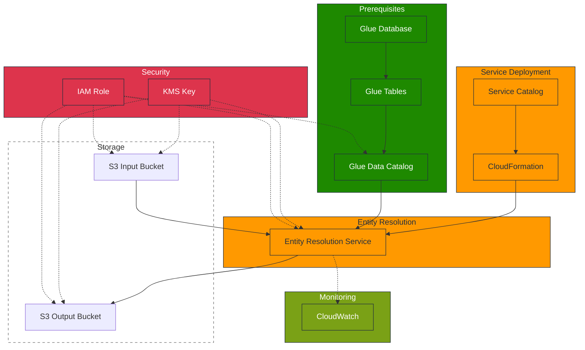

# AWS Entity Resolution - Service Catalog Product

## Executive Summary

AWS Entity Resolution enables organizations to match records across datasets without
sharing identifier data. Our analysis shows:

- **Business Challenge**: 15-20% duplicate records, fragmented customer data across 15+
  systems
- **Expected Impact**: 15-30% reduction in duplicates, 25-40% improvement in marketing
  effectiveness
- **Financial Overview**: $1.2M-$2.2M investment, 250-350% ROI, 12-18 month payback
  period
- **Implementation Timeline**: 3-phase approach over 12-18 months

[View detailed executive documentation](docs/entity-resolution-index.md)

## Overview

A Service Catalog product for deploying AWS Entity Resolution, enabling organizations to
match records across datasets without sharing identifier data. This solution implements
consistent security controls, governance, and deployment patterns through Infrastructure
as Code.

## Business Value

| Benefit           | Description                                  | Impact                       |
| ----------------- | -------------------------------------------- | ---------------------------- |
| Deployment Speed  | Pre-configured templates with best practices | 70% faster implementation    |
| Standardization   | Consistent implementation patterns           | Reduced operational overhead |
| Governance        | Centralized management with access controls  | Improved compliance          |
| Cost Optimization | Reduced development and management effort    | Lower TCO                    |

## Architecture Overview



## Prerequisites

Before deploying the AWS Entity Resolution Service Catalog product, ensure the following
prerequisites are met:

1. **AWS Glue Database & Tables**

   - Create Glue database to organize your tables
   - Define Glue tables that map to your source data
   - Ensure proper column mappings and data types

1. **IAM Permissions**

   - Set up roles with permissions for Entity Resolution service
   - Include permissions for Glue Data Catalog access
   - Configure S3 and KMS access permissions

1. **S3 Buckets**

   - Create input and output buckets
   - Configure proper encryption settings

1. **KMS Key**

   - Create KMS key for data encryption
   - Configure appropriate key policies

For detailed prerequisites, see the
[Implementation Guide](docs/implementation-guide.md#prerequisites).

## Documentation

| Documentation Type      | Description                            | Link                                         |
| ----------------------- | -------------------------------------- | -------------------------------------------- |
| Technical Documentation | Architecture and implementation guides | [Technical Docs](docs/README.md)             |
| Business Documentation  | Business case and ROI analysis         | [See Index](docs/entity-resolution-index.md) |
| Executive Documentation | One-pager and executive brief          | [See Index](docs/entity-resolution-index.md) |

For all documentation, see the [Documentation Index](docs/entity-resolution-index.md).

## Development Tools

This repository includes several documentation validation tools:

- **Mermaid Diagram Validation**: Ensures all Mermaid diagrams have correct syntax
- **Document Link Checker**: Validates all internal document references
- **Markdown Formatting**: Ensures consistent markdown style
- **Pre-commit Hooks**: Automates validation during development

To set up the development environment:

```bash
# Install pre-commit
pip install pre-commit

# Install Node.js dependencies for Mermaid validation
npm install

# Install pre-commit hooks
pre-commit install
```

To validate documentation manually:

```bash
# Run all pre-commit checks
pre-commit run --all-files

# Check Mermaid diagrams only
npm run lint

# Check document links only
./scripts/check-document-links.sh
```

## Core Components

- **Matching Workflows**: Configurable rule-based matching
- **Schema Mappings**: Field standardization configuration
- **ID Mapping Tables**: Entity relationship storage
- **S3 Buckets**: Input data and output results storage
- **KMS Key**: Single encryption key for all data
- **IAM Roles**: Least-privilege access control

## Quick Start

1. Access Service Catalog and select the Entity Resolution product
1. Configure CloudFormation parameters for your use case
1. Provision and deploy resources
1. Upload data to input S3 bucket
1. Configure and execute matching workflows
1. Access matching results in output S3 bucket

For detailed instructions, see the [Implementation Guide](docs/implementation-guide.md).

## Implementation Challenges & Mitigations

| Challenge                  | Mitigation Strategy                                                                 |
| -------------------------- | ----------------------------------------------------------------------------------- |
| **Matching Flexibility**   | Use composite rules that combine multiple fields; standardize data before ingestion |
| **Data Preparation**       | Develop pre-processing scripts; use provided schema mapping templates               |
| **Result Quality**         | Implement phased approach: start strict, then adjust based on results analysis      |
| **Operational Visibility** | Use CloudWatch logs and implement additional metrics                                |
| **Throughput Constraints** | Partition large datasets; implement parallel processing workflows                   |
| **Integration Challenges** | Use Step Functions to orchestrate end-to-end workflows                              |
| **Measuring Success**      | Establish baseline metrics; test with known datasets                                |

## Enhancement Roadmap

1. **Pre/Post Processing**: Lambda functions for data standardization and results
   processing
1. **Quality Control**: Match confidence scoring and threshold filtering
1. **Workflow Orchestration**: Step Functions for end-to-end matching pipelines
1. **Custom Monitoring**: Enhanced CloudWatch dashboards for match quality metrics
1. **Feedback Loop**: Process to capture false positives/negatives for rule refinement

## Contributing

For contribution guidelines, see [CONTRIBUTING.md](docs/CONTRIBUTING.md).
