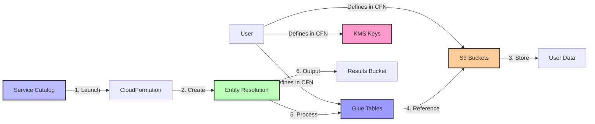

# AWS Entity Resolution - Service Catalog Product

## Overview

This Service Catalog product provides a standardized way to implement AWS Entity
Resolution workflows for matching records across datasets without sharing identifier
data. It enables organizations to deploy entity resolution capabilities with consistent
security controls, governance, and deployment patterns.

## Key Benefits

- **Time Savings**: Deploy entity resolution workflows in hours instead of weeks
- **Standardization**: Consistent implementation with security best practices
- **Governance**: Centralized management with proper access controls
- **Efficiency**: Reduced operational overhead and maintenance costs
- **Scalability**: Designed for enterprise-scale data matching needs

## Architecture



## Implementation Requirements

### Critical Requirements

1. **User-Defined Resources**: You must define Glue Tables, S3 buckets, and KMS keys in
   the same CloudFormation template
1. **Glue Tables**: AWS Entity Resolution reads data exclusively from Glue Tables (not
   directly from S3)
1. **Limitations**: Partitioned tables and S3 locations registered with AWS Lake
   Formation are not supported

### CloudFormation Template Components

- **Entity Resolution Resources**

  - Matching workflows with configurable parameters
  - Schema mappings for standardized data formats
  - ID mapping tables for entity relationships

- **User-Defined Resources**

  - Glue Database and Tables
  - S3 buckets for data storage and results
  - KMS keys for encryption

- **Supporting Resources**

  - IAM roles with proper permissions
  - CloudWatch monitoring and logging

### Resource Configuration Example

```yaml
# KMS Key for Encryption
DataEncryptionKey:
  Type: AWS::KMS::Key
  Properties:
    Description: "KMS key for Entity Resolution data"
    EnableKeyRotation: true
    KeyPolicy:
      # Key policy details...

# S3 Bucket for Input Data
InputBucket:
  Type: AWS::S3::Bucket
  Properties:
    BucketEncryption:
      ServerSideEncryptionConfiguration:
        - ServerSideEncryptionByDefault:
            SSEAlgorithm: aws:kms
            KMSMasterKeyID: !GetAtt DataEncryptionKey.Arn

# Glue Database
GlueDatabase:
  Type: AWS::Glue::Database
  Properties:
    CatalogId: !Ref AWS::AccountId
    DatabaseInput:
      Name: !Sub "${AWS::StackName}-database"

# Glue Table
CustomerTable:
  Type: AWS::Glue::Table
  Properties:
    CatalogId: !Ref AWS::AccountId
    DatabaseName: !Ref GlueDatabase
    TableInput:
      Name: customer_data
      StorageDescriptor:
        Location: !Sub "s3://${InputBucket}/customer-data/"
        # Additional table configuration...
```

## Security Considerations

- **Data Encryption**: All data must be encrypted at rest using KMS keys
- **IAM Permissions**: Entity Resolution service requires access to your Glue Tables, S3
  buckets, and KMS keys
- **Access Controls**: Implement proper bucket policies and IAM roles
- **Monitoring**: Set up CloudWatch alerts for security events and operational
  monitoring

## Deployment Process

1. Request the Service Catalog product from your administrator
1. Customize the CloudFormation parameters for your use case
1. Define your Glue Tables, S3 buckets, and KMS keys in the template
1. Launch the product through Service Catalog
1. Upload your data to your S3 bucket
1. Configure and run your matching workflows
1. Access matching results in your output bucket

## Documentation Structure

This consolidated README provides an overview of the AWS Entity Resolution Service
Catalog product. For detailed information on specific aspects, refer to:

| Document                                                        | Purpose                                             |
| --------------------------------------------------------------- | --------------------------------------------------- |
| [Implementation Guide](implementation-plan.md)                  | Step-by-step implementation process                 |
| [Resource Configuration Guide](resource-configuration-guide.md) | Detailed configuration for Glue Tables, S3, and KMS |
| [Security Considerations](security-considerations.md)           | In-depth security controls and compliance           |
| [Contributing Guide](docs/CONTRIBUTING.md)                      | How to contribute to documentation                  |
| [Validation Guide](docs/VALIDATION.md)                          | Documentation and Mermaid diagram validation        |

### Documentation Quality Tools

This repository uses pre-commit hooks to ensure high-quality documentation:

- **Markdown Linting**: Enforces consistent styling and formatting
- **Automated Formatting**: Maintains consistent document formatting

To use these tools:

```bash
pip install pre-commit
pre-commit install
```

Or run the validation script:

```bash
./validate-docs.sh
```

## Development

### Mermaid Diagrams

This project uses Mermaid for creating diagrams in markdown files:

1. **Pre-commit Hook**: Mermaid diagrams are automatically checked before commits
1. **Live Editor**: Use [Mermaid Live Editor](https://mermaid.live/) to test diagrams
   before adding them

To fix a diagram, check the error message from the pre-commit hook and make the
necessary corrections.

## Troubleshooting

Common issues and solutions:

- **Access Denied Errors**: Check IAM roles and KMS key policies
- **Glue Table Not Found**: Ensure Glue Tables are correctly defined in the
  CloudFormation template
- **Entity Resolution Workflow Failures**: Verify schema mappings match your data format
- **Performance Issues**: Check for data volume constraints or throttling
