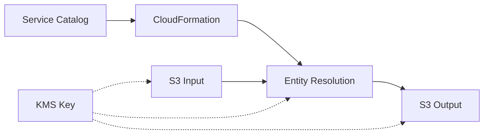

# AWS Entity Resolution - Technical Architecture

This document provides a simplified technical architecture for the AWS Entity Resolution
Service Catalog product.

## Business Value

| Benefit                   | Description                                  | Impact                       |
| ------------------------- | -------------------------------------------- | ---------------------------- |
| **Simplified Deployment** | Pre-configured templates with best practices | 70% faster implementation    |
| **Standardization**       | Consistent implementation                    | Reduced operational overhead |
| **Governance**            | Centralized management                       | Improved oversight           |
| **Cost Optimization**     | Standardized implementation                  | Reduced development costs    |

## Core Architecture



## Simplified Data Flow

1. User requests the Service Catalog product
1. CloudFormation creates Entity Resolution resources
1. User uploads data to S3 input bucket
1. Entity Resolution processes data directly from S3
1. Results are stored in S3 output bucket
1. Single KMS key encrypts all data at rest

## Key Components

### Entity Resolution

- **Schema Mapping**: Maps source data fields to standardized formats
- **Matching Workflow**: Defines match rules for identity resolution
- **ID Mapping Table**: Stores entity relationships

### Required Infrastructure

- **S3 Buckets**: Store source data and results
- **KMS Key**: Single key for encrypting all data at rest

## Security Essentials

The only security requirement is ensuring the Entity Resolution service has access to
the KMS key used to encrypt your data:

```yaml
# Example KMS key policy allowing Entity Resolution access
KeyPolicy:
  Version: "2012-10-17"
  Statement:
    - Effect: Allow
      Principal:
        Service: "entityresolution.amazonaws.com"
      Action:
        - "kms:Encrypt"
        - "kms:Decrypt"
        - "kms:ReEncrypt*"
        - "kms:GenerateDataKey*"
        - "kms:DescribeKey"
      Resource: "*"
```

## Technical Limitations

- AWS Entity Resolution works best with properly formatted CSV or JSON data
- Input data should be in the correct format for Entity Resolution processing

## User Responsibilities

1. **Data Preparation**: Ensure data is in the correct format for Entity Resolution
1. **Schema Mapping**: Configure how source data maps to standard formats
1. **Security Configuration**: Set up appropriate encryption and access controls
1. **Matching Rules**: Define criteria for matching records

## Success Metrics

- 70% reduction in entity resolution deployment time
- 100% compliance with security and governance standards
- Successful integration with existing data workflows
- User self-service capability for provisioning
