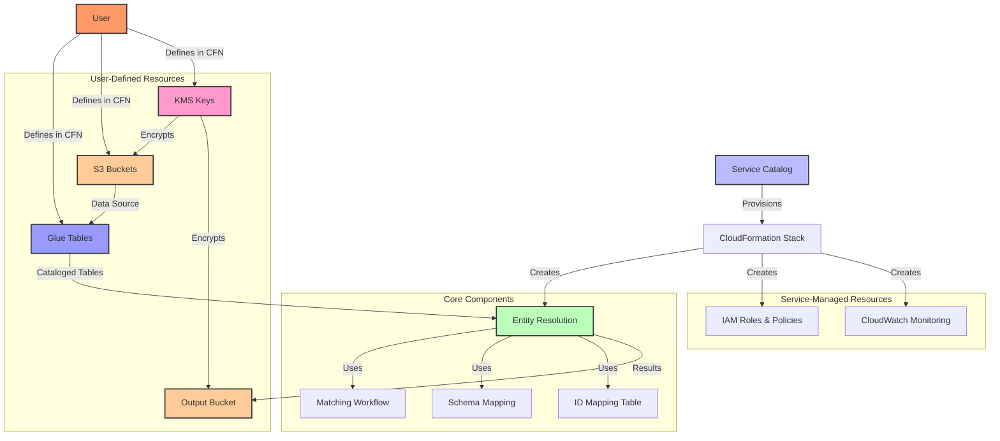
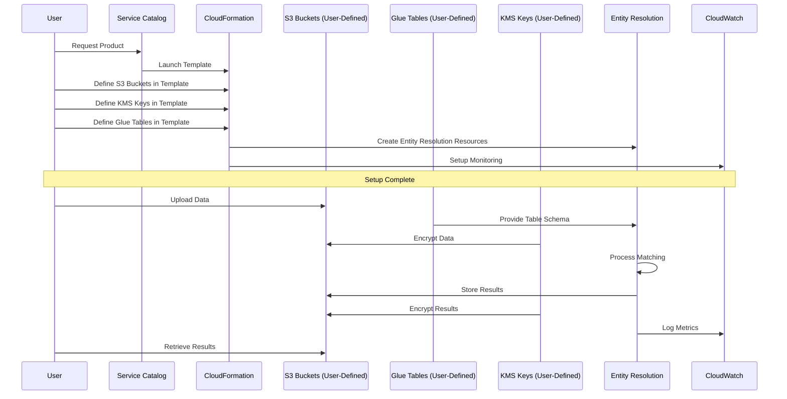

# AWS Entity Resolution - Technical Architecture

This document provides the technical architecture and business value proposition for the AWS Entity Resolution Service Catalog product.

## Business Value

| Benefit | Description | Impact |
|---------|-------------|--------|
| **Simplified Deployment** | Pre-configured templates with best practices | 70% faster implementation |
| **Standardized Security** | Consistent security controls and encryption | Reduced compliance risk |
| **Operational Efficiency** | Automated workflows and monitoring | 30-40% reduced maintenance |
| **Governance** | Centralized management and auditing | Improved oversight |
| **Cost Optimization** | Standardized implementation | Reduced development costs |

## Solution Architecture

## Data Flow

## Key Components

### 1. Core Entity Resolution Components

* **Schema Mapping**: Maps source data fields to standardized formats for matching
* **Matching Workflow**: Defines match rules and configurations for identity resolution
* **ID Mapping Table**: Stores entity relationships and match results

### 2. User-Defined Resources

#### Glue Tables
* **Purpose**: Provide structured data access for Entity Resolution
* **Limitations**: 
  * No partitioned tables
  * No Lake Formation integration
* **Configuration**: Defined in the same CloudFormation template

#### S3 Buckets
* **Input Bucket**: Storage for source data with user-defined lifecycle policies
* **Output Bucket**: Storage for match results
* **Configuration**: User defines bucket names, policies, and settings

#### KMS Keys
* **Purpose**: Encrypt data at rest in S3 buckets
* **Configuration**: User defines key policies and rotation settings
* **Requirements**: Entity Resolution service needs access to the keys

### 3. Service-Managed Resources

* **IAM Roles**: Least-privilege access for all components
* **CloudWatch**: Monitoring, audit logging, and alerting

## Technical Limitations

* AWS Entity Resolution does not support partitioned Glue tables
* AWS Entity Resolution does not support Amazon S3 locations registered with AWS Lake Formation
* Input data in S3 is intended to be temporary with lifecycle management

## User Responsibilities

1. **Resource Definition**: Define Glue tables, S3 buckets, and KMS keys in CloudFormation
2. **Data Preparation**: Ensure data is in the correct format for Entity Resolution
3. **Schema Mapping**: Configure how source data maps to standard formats
4. **Security Configuration**: Set up appropriate encryption and access controls
5. **Matching Rules**: Define criteria for matching records

## Success Metrics

* 70% reduction in entity resolution deployment time
* 100% compliance with security and governance standards
* Successful integration with existing data workflows
* User self-service capability for provisioning 