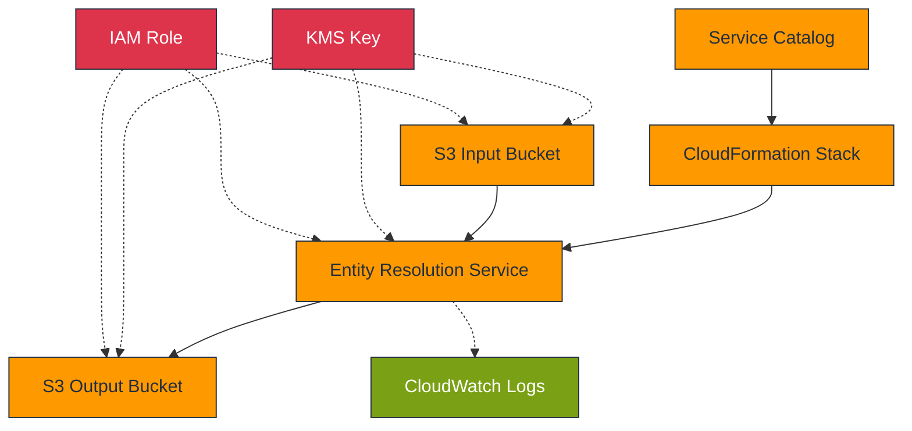
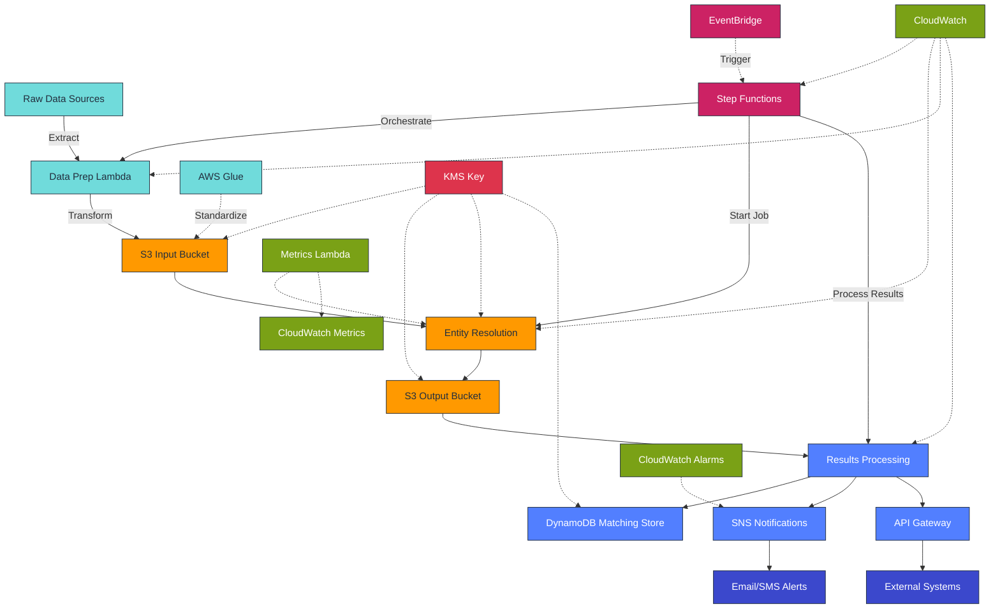
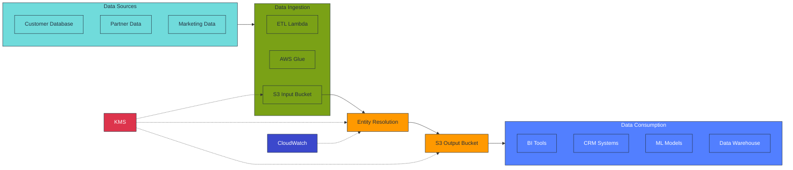
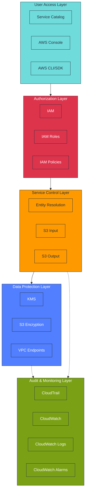
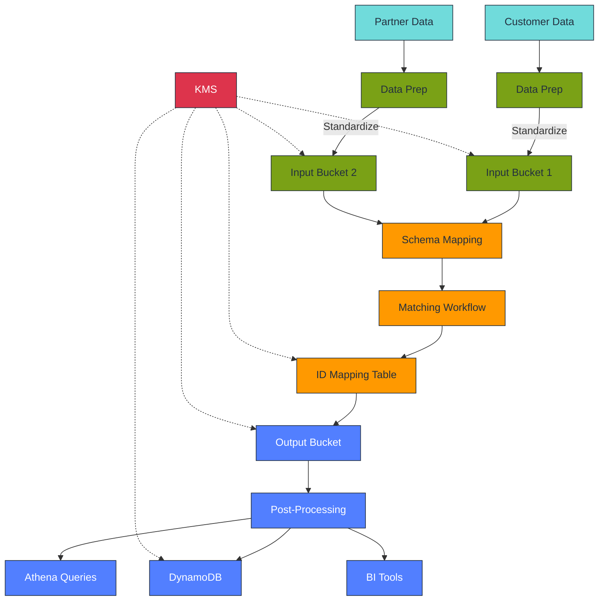

# AWS Entity Resolution - Technical Architecture

This document provides the technical architecture for the AWS Entity Resolution Service
Catalog product, designed for secure, efficient entity matching operations.

## Business Outcomes

| Outcome                     | Measure                   | Target        |
| --------------------------- | ------------------------- | ------------- |
| Accelerated Deployment      | Implementation time       | 70% reduction |
| Operational Standardization | Deviation from standards  | \<5%          |
| Governance Compliance       | Security control coverage | 100%          |
| Cost Optimization           | Development effort        | 60% reduction |

## Architecture Diagram



## Component Specifications

### Entity Resolution Service

- **Purpose**: Match and link records across datasets without sharing identifiers
- **Features**:
  - Rule-based or ML-based matching
  - Customizable matching workflows
  - Schema mapping for data standardization
- **Integrations**: S3, KMS, CloudWatch

### Infrastructure Components

| Component        | Type     | Purpose             | Configuration                   |
| ---------------- | -------- | ------------------- | ------------------------------- |
| S3 Input Bucket  | Storage  | Source data storage | Server-side encryption with KMS |
| S3 Output Bucket | Storage  | Results storage     | Server-side encryption with KMS |
| KMS Key          | Security | Data encryption     | Auto-rotation enabled           |
| IAM Role         | Security | Service permissions | Least privilege principle       |

## Data Flow

1. **Ingestion**: Customer data uploaded to S3 input bucket with KMS encryption
1. **Processing**: Entity Resolution service processes data using matching workflow
   - Data access requires KMS decryption
   - Matching performed using specified rules or ML
1. **Storage**: Results written to S3 output bucket with KMS encryption
1. **Access**: Results available for downstream analysis or application integration

## Security Controls

| Control         | Implementation                | Validation             |
| --------------- | ----------------------------- | ---------------------- |
| Data Encryption | KMS with CMK                  | Verify bucket policies |
| Access Control  | IAM role with least privilege | Review permissions     |
| Logging         | CloudWatch integration        | Confirm log groups     |
| Key Rotation    | Automatic KMS rotation        | Verify key policy      |

## Technical Limitations

- Maximum individual file size: 1GB
- Supported formats: CSV, JSON
- Processing timeout: 24 hours per job
- Maximum matching rules per workflow: 15

## Architectural Considerations

Based on implementation experience and customer feedback, this section outlines key
architectural considerations to address common pain points:

### Enhanced Architecture for Improved Matching



### Addressing Primary Customer Concerns

| Concern                          | Architectural Solution                                                                                                                                                  |
| -------------------------------- | ----------------------------------------------------------------------------------------------------------------------------------------------------------------------- |
| **Limited Matching Flexibility** | • Implement multi-stage matching pipeline<br>• Use preprocessing Lambda functions for data standardization<br>• Consider supplementary matching tools for complex cases |
| **Results Quality**              | • Add confidence scoring via post-processing Lambda<br>• Store match results in DynamoDB for queryability<br>• Implement feedback loop via Step Functions workflow      |
| **Performance Constraints**      | • Partition data using S3 prefix organization<br>• Implement parallel processing with Step Functions Map state<br>• Use SQS for managing job backlogs                   |
| **Integration Challenges**       | • Add EventBridge rules for workflow automation<br>• Implement webhook notifications for process completion<br>• Use API Gateway for results access APIs                |

### Reference Architecture: Enterprise Implementation

For large-scale implementations, consider this enhanced architecture:

```yaml
# Architecture components for enterprise implementation
Components:
  - Name: DataPreparationLayer
    Purpose: Standardize input data before matching
    Services:
      - AWS Lambda (data transformation)
      - AWS Glue (ETL jobs for large datasets)
      - Amazon S3 (staged data storage)

  - Name: MatchingLayer
    Purpose: Core Entity Resolution processing
    Services:
      - AWS Entity Resolution (matching service)
      - Step Functions (workflow orchestration)
      - CloudWatch (monitoring and alerting)

  - Name: ResultsLayer
    Purpose: Process and distribute match results
    Services:
      - Lambda (results processing)
      - DynamoDB (matched entities storage)
      - SNS (notifications)
      - API Gateway (results access)

  - Name: GovernanceLayer
    Purpose: Oversight and management
    Services:
      - CloudTrail (audit logging)
      - CloudWatch Dashboards (operational metrics)
      - Service Catalog (provisioning control)
```

### Critical Success Factors

For optimal Entity Resolution implementation:

1. **Data Quality Focus**: Invest in data standardization before matching
1. **Iterative Rule Development**: Test and refine matching rules with known datasets
1. **Enhanced Monitoring**: Implement custom CloudWatch metrics for match quality
1. **Process Automation**: Use Step Functions for end-to-end orchestration
1. **Results Validation**: Implement automated and manual validation processes

## Integration Points



## Security Architecture



## Implementation Workflow

```mermaid
flowchart LR
    %% Planning Phase
    subgraph Planning [Planning Phase]
        REQ[Requirements Gathering]
        SEC[Security Planning]
        DATA[Data Strategy]
    end

    %% Development Phase
    subgraph Development [Development Phase]
        CFN[CloudFormation Template]
        TEST[Unit Testing]
        IAC[Infrastructure as Code]
    end

    %% Test Phase
    subgraph Testing [Test Phase]
        TF[Test Fixtures]
        QA[Quality Assurance]
        SEC_TEST[Security Testing]
    end

    %% Deployment Phase
    subgraph Deployment [Deployment Phase]
        SC[Service Catalog]
        DOCS[Documentation]
        TRAIN[User Training]
    end

    %% Operations Phase
    subgraph Operations [Operations Phase]
        MON[Monitoring]
        MAINT[Maintenance]
        OPT[Optimization]
    end

    %% Flow
    Planning --> Development
    Development --> Testing
    Testing --> Deployment
    Deployment --> Operations
    Operations -.-> |Feedback| Planning

    %% Classification
    classDef plan fill:#70DBDB,stroke:#232F3E,color:#232F3E
    classDef dev fill:#FF9900,stroke:#232F3E,color:#232F3E
    classDef test fill:#DD344C,stroke:#232F3E,color:white
    classDef deploy fill:#527FFF,stroke:#232F3E,color:white
    classDef ops fill:#7AA116,stroke:#232F3E,color:white

    class Planning,REQ,SEC,DATA plan
    class Development,CFN,TEST,IAC dev
    class Testing,TF,QA,SEC_TEST test
    class Deployment,SC,DOCS,TRAIN deploy
    class Operations,MON,MAINT,OPT ops
```



## Data Flow Architecture



## User Responsibilities

1. **Data Preparation**: Ensure data is in the correct format for Entity Resolution
1. **Schema Mapping**: Configure how source data maps to standard formats
1. **Security Configuration**: Set up appropriate encryption and access controls
1. **Matching Rules**: Define criteria for matching records

## Success Metrics

- 70% reduction in entity resolution deployment time
- 100% compliance with security and governance standards
- Successful integration with existing data workflows
- User self-service capability for provisioning
