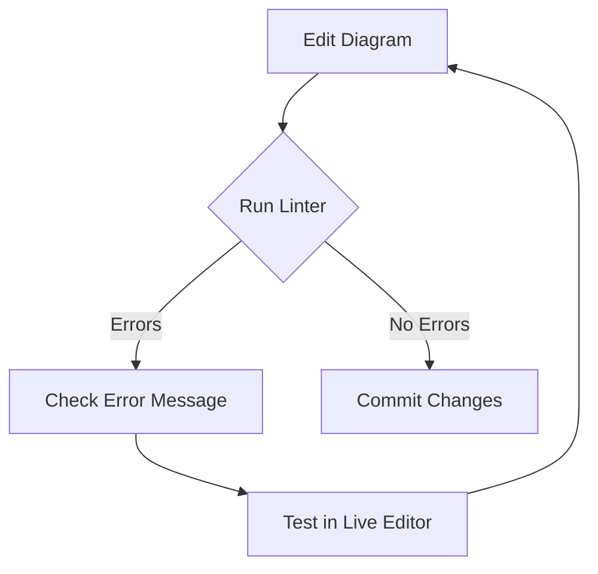

### Mermaid Diagram Validation

The repository contains automated validation for Mermaid diagrams through pre-commit
hooks:

- **Pre-commit Mermaid Hook**: Extracts and validates Mermaid syntax
  - Automatically runs before commits

#### Fixing Mermaid Errors

If you encounter Mermaid diagram errors:

1. Check the error message for details on what's wrong
1. Test your diagram in the [Mermaid Live Editor](https://mermaid.live/) before
   committing
1. For complex diagrams, build them incrementally to identify exactly where issues occur

