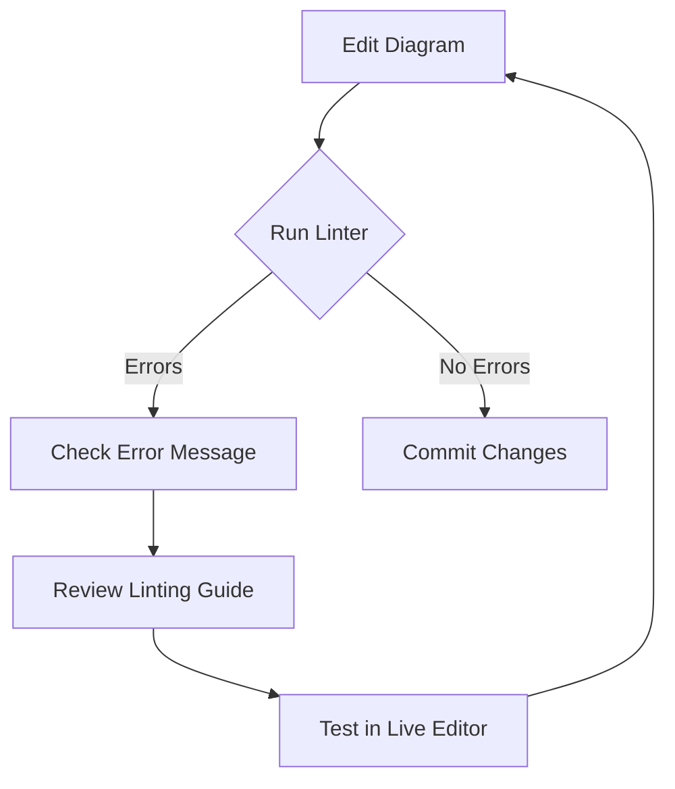
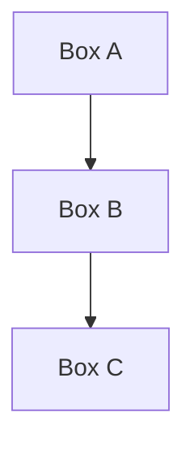

# Contributing to the AWS Entity Resolution Documentation

This guide explains how to contribute to the AWS Entity Resolution documentation, including how to use our pre-commit hooks to validate documentation and Mermaid diagrams.

## Getting Started

1. Clone the repository
2. Install pre-commit:
   ```bash
   pip install pre-commit
   pre-commit install
   ```

## Pre-commit Hooks

We use several pre-commit hooks to ensure documentation quality:

### Documentation Style and Formatting

- **markdownlint**: Checks Markdown files for style issues
- **mdformat**: Automatically formats Markdown files
- **trailing-whitespace, end-of-file-fixer**: Fixes common whitespace issues

### Mermaid Diagram Validation

The repository contains automated validation for Mermaid diagrams through pre-commit hooks. We use two complementary approaches:

1. **Custom Node.js Linter**: Provides detailed error messages with line numbers
   - Runs via pre-commit hook
   - Can be manually run with `./lint-mermaid.sh`

2. **Pre-commit Mermaid Hook**: Extracts and validates Mermaid syntax
   - Automatically runs before commits
   - Less detailed errors but broader compatibility

#### Fixing Mermaid Errors

If you encounter Mermaid diagram errors:

1. Check the error message for details on what's wrong
2. Refer to our [Mermaid Linting Guide](MERMAID-LINTING.md) for common issues and solutions
3. Test your diagram in the [Mermaid Live Editor](https://mermaid.live/) before committing
4. For complex diagrams, build them incrementally to identify exactly where issues occur



## Writing Mermaid Diagrams

When creating Mermaid diagrams, use the following format:

````markdown

````

### Common Mermaid Diagram Types

1. **Flowcharts** (using `graph` or `flowchart`):
   ```mermaid
   graph LR
       Start --> Process --> End
   ```

2. **Sequence Diagrams**:
   ```mermaid
   sequenceDiagram
       Alice->>John: Hello John, how are you?
       John-->>Alice: Great!
   ```

3. **Class Diagrams**:
   ```mermaid
   classDiagram
       Class01 <|-- AveryLongClass
       Class03 *-- Class04
   ```

## Validation Process

1. When you commit changes, pre-commit will automatically run all hooks
2. If a Mermaid diagram has syntax errors, the commit will be blocked with error details
3. Fix the issues and try committing again

## Troubleshooting

### Mermaid Validation Failures

If the Mermaid validation fails:

1. Look at the error message, which will indicate the file and the specific syntax error
2. Refer to the [Mermaid syntax documentation](https://mermaid-js.github.io/mermaid/#/) for correct syntax
3. Try testing your diagram with the [Mermaid Live Editor](https://mermaid.live/)

### Skipping Validation

In rare cases where you need to commit without validation:

```bash
git commit --no-verify -m "Your commit message"
```

However, this should be avoided unless absolutely necessary.

## Resources

- [Mermaid Documentation](https://mermaid-js.github.io/mermaid/#/)
- [Markdown Guide](https://www.markdownguide.org/)
- [Pre-commit Documentation](https://pre-commit.com/) 