# Mermaid Diagram Linting Guide

This guide explains the Mermaid diagram linting setup in this project and how to fix common issues.

## Linting Setup

This project uses two complementary approaches to lint Mermaid diagrams:

1. **Custom Node.js Linter** (`mermaid-lint.js`): Uses the official Mermaid parser to validate diagrams and provide detailed error messages with line numbers.

2. **Pre-commit Mermaid Hook** (`pre-commit-mermaid`): Validates Mermaid diagrams before committing changes.

## Running the Linters

### Manual Linting

To lint all Mermaid diagrams in the project:

```bash
# Using the convenience script
./lint-mermaid.sh

# Or directly with npm
npm run lint
```

### Pre-commit Hooks

The linters run automatically when you commit changes if you've set up pre-commit:

```bash
# Install pre-commit if you haven't already
pip install pre-commit

# Install the hooks
pre-commit install
```

## CI/CD Integration

The Mermaid linting is also integrated into the CI/CD pipeline via GitHub Actions. The linter runs automatically on push and pull requests that include Markdown files.

## Common Mermaid Syntax Issues and Solutions

### 1. Invalid Diagram Type

**Problem:**
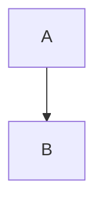

**Solution:**


Newer Mermaid versions prefer `flowchart` over `graph`.

### 2. Missing Direction in Flowcharts

**Problem:**


**Solution:**
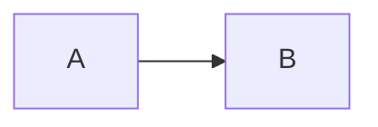

Always specify direction: LR (left to right), TD/TB (top to bottom), RL (right to left), BT (bottom to top).

### 3. Invalid Connections in Flowcharts

**Problem:**
```mermaid
flowchart LR
    A --- B
    B ->-> C
```

**Solution:**
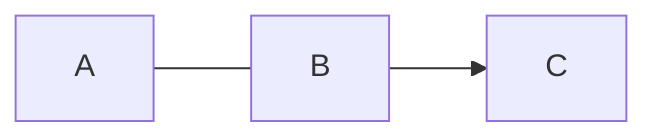

Valid connections include: `-->`, `---`, `--text-->`, `-.->`

### 4. Sequence Diagram Issues

**Problem:**
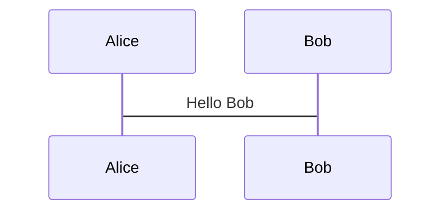

**Solution:**
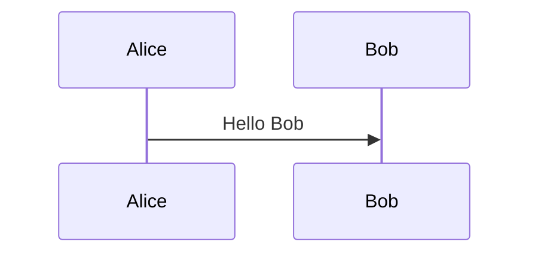

Use `->>` for arrows in sequence diagrams.

### 5. Missing Participants in Sequence Diagrams

**Problem:**
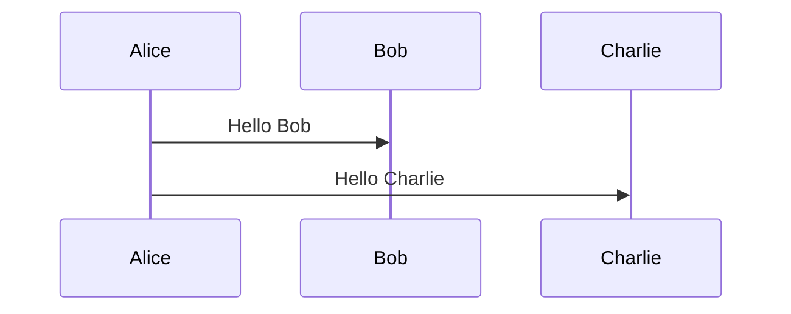

**Solution:**


Define all participants at the beginning.

### 6. Class Diagram Issues

**Problem:**
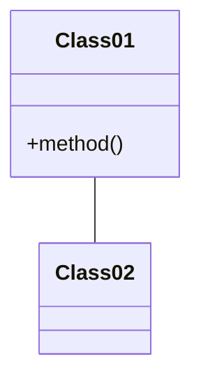

**Solution:**
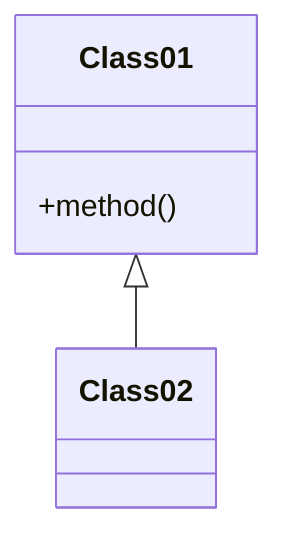

Use proper relationship types: `<|--` (inheritance), `*--` (composition), `o--` (aggregation).

### 7. Entity Relationship Diagram Issues

**Problem:**
```mermaid
erDiagram
    CUSTOMER |o--o{ ORDER
```

**Solution:**
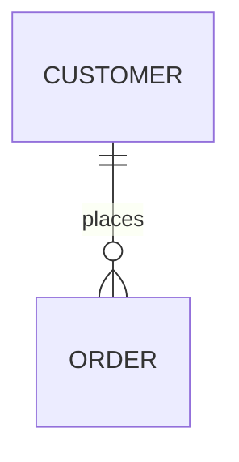

Include relationship labels and use proper cardinality notation.

### 8. Indentation Issues

**Problem:**
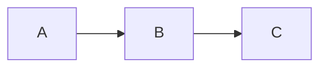

**Solution:**


Use consistent indentation.

### 9. Subgraph Syntax Issues

**Problem:**
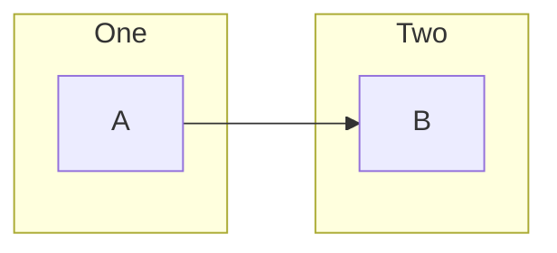

**Solution:**


Format subgraphs properly.

### 10. Style Issues

**Problem:**
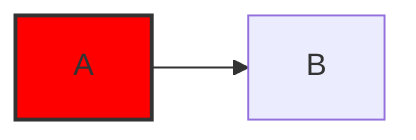

**Solution:**


Use valid CSS color notations.

## Mermaid Documentation Resources

- [Official Mermaid Documentation](https://mermaid-js.github.io/mermaid/#/)
- [Mermaid Live Editor](https://mermaid.live/) - Test diagrams before committing
- [Mermaid Cheat Sheet](https://jojozhuang.github.io/tutorial/mermaid-cheat-sheet/)

## Troubleshooting

If you encounter a linting error:

1. Check the exact error message and line number
2. Test your diagram in the [Mermaid Live Editor](https://mermaid.live/)
3. Refer to the examples above or the official documentation
4. For complex diagrams, build them incrementally, validating each step 