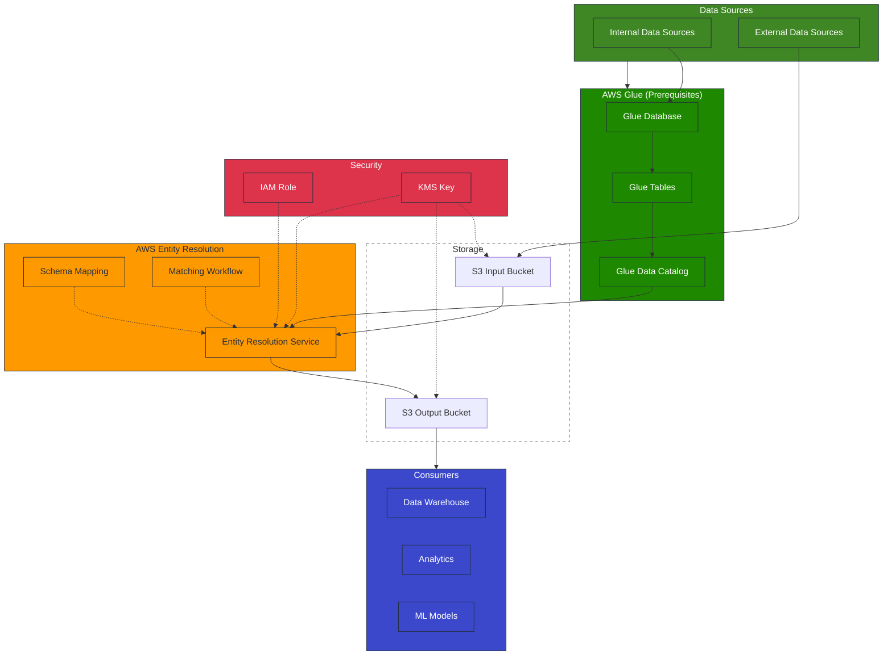

# AWS Entity Resolution: Technical Architecture

## Overview

This document outlines the technical architecture for implementing AWS Entity Resolution
within our organization. AWS Entity Resolution is a fully managed service that helps us
match and link related records stored across multiple applications, channels, and data
stores. The architecture focuses on the core functionality of AWS Entity Resolution to
provide a streamlined implementation approach.

AWS Entity Resolution offers built-in matching techniques including rule-based matching,
machine learning-based matching, and data service provider-led matching to link related
sets of customer information, product codes, or business data. It enables us to create a
unified view across our data sources using AWS-managed components without requiring
custom development.

## Architecture Diagram

## Component Details

### Data Sources

1. **Internal Systems**

   - CRM systems
   - Transaction processing systems
   - Customer service platforms
   - Marketing automation tools
   - Product management systems

1. **AWS Glue Data Catalog**[¹](#references)

   - Centralized metadata repository containing Glue Databases and Tables
   - Maintains table definitions and schema information
   - AWS Entity Resolution requires Glue Tables for processing
   - Acts as the primary data source for AWS Entity Resolution

1. **S3 Input Bucket**

   - Storage for batch data files
   - Supports encrypted data ingestion
   - Used for external data provider feeds

### Core Entity Resolution Components

1. **Schema Mapping**[²](#references)

   - Define data schemas for each source system (up to 20 data inputs supported)
   - Map source fields to standard entity attributes
   - Create schemas from AWS Glue data catalog (databases and tables)
   - Note: Data normalization is handled outside the scope of Entity Resolution

1. **Matching Workflows**[²](#references)

   - Rule-based matching with configurable rules and priorities
   - ML-based matching for complex scenarios with confidence scoring (0.0-1.0)
   - Provider-led matching for data enrichment and third-party integrations
   - Automatic or manual processing cadence options
   - Support for match threshold customization

1. **Processing Models**[²](#references)

   - Batch processing for large datasets (manual bulk processing)
   - Automatic incremental processing for new records (rule-based matching only)
   - Near real-time lookups via GetMatchId API

1. **S3 Output Bucket**

   - Stores match results with unique identifiers
   - Maintains resolution history
   - Supports encrypted storage of matched data

### Security Components

1. **IAM Roles and Policies**[³](#references)

   - Service role for Entity Resolution
   - Data access policies for input/output buckets

1. **Data Protection Features**[²](#references)

   - Regional data processing (data remains in the AWS Region where processed)
   - Option to hide fields in output
   - Support for encrypted S3 buckets

### Monitoring and Observability

1. **Job Metrics**[²](#references)

   - Processing status and completion rates
   - Record counts processed
   - Match counts identified
   - Basic job statistics

## Data Flow

### Batch Resolution Process

1. Source systems export data to AWS Glue tables or S3 buckets
1. AWS Entity Resolution reads data from Glue Data Catalog
1. Matching workflows execute based on defined rules or ML models
1. Match results are written to S3 output bucket with unique match IDs
1. Downstream systems consume match results for business processes

### Real-time Resolution Process

1. Application calls GetMatchId API with entity attributes
1. AWS Entity Resolution service processes the request
1. Service returns match ID if entity matches existing records
1. Application uses match ID to retrieve unified information

## Use Case Implementations

### Customer 360 View

Objective: Create unified customer profiles across all business units

Components:

- Customer data from CRM, transaction systems, and marketing platforms
- Rule-based matching on customer identifiers
- ML-based matching for complex scenarios
- API integration with customer-facing applications

### Product Data Harmonization

Objective: Reconcile product information across supply chain and sales systems

Components:

- Product data from ERP, inventory, and e-commerce systems
- Rule-based matching on product identifiers (SKU, UPC, etc.)
- Incremental processing for catalog updates
- Integration with product information management systems

### Compliance and Risk Management

Objective: Improve entity identification for regulatory compliance

Components:

- Customer data with enhanced KYC attributes
- Third-party data integration for verification
- High-precision matching rules for legal entities
- Integration with risk assessment systems

## Scalability and High Availability

- AWS Entity Resolution is a fully managed service with built-in scalability
- Available in multiple AWS Regions: US East (Ohio, N. Virginia), US West (Oregon), Asia
  Pacific (Seoul, Singapore, Sydney, Tokyo), and Europe (Frankfurt, Ireland, London)
- Multi-AZ deployment for high availability
- Automatic scaling based on workload
- No infrastructure management required

## Cost Optimization

- Pay-per-use pricing model based on the number of source records
  processed[⁴](#references)
- Pricing does not depend on matching method (same cost for rule-based or ML matching)
- Optimize batch processing schedules to reduce processing costs
- Use incremental processing where possible to minimize processing volume
- Monitor and adjust real-time API usage for cost-effective operations

## Implementation Roadmap

### Phase 1: Foundation (1-3 months)

- Establish AWS Entity Resolution infrastructure
- Configure security controls and access policies
- Implement initial schema mappings for primary data sources
- Ensure Glue Data Catalog and Tables are properly configured for Entity Resolution
- Develop and test basic matching workflows

### Phase 2: Core Use Cases (3-6 months)

- Implement Customer 360 use case
- Integrate with key operational systems
- Establish monitoring and quality metrics
- Refine matching rules based on feedback

### Phase 3: Advanced Capabilities (6-12 months)

- Implement additional use cases
- Deploy ML-based matching for complex scenarios
- Develop real-time resolution capabilities
- Integrate with analytics and data science platforms

## Conclusion

The proposed AWS Entity Resolution architecture provides a scalable, secure, and
flexible foundation for resolving entity data across our organization. By leveraging the
managed service capabilities of AWS, we can implement entity resolution with minimal
infrastructure management while achieving high performance and reliability.

This architecture supports our key use cases while providing a path for future expansion
and enhancement of our entity resolution capabilities.

## References

1. [AWS Glue Data Catalog Documentation](https://docs.aws.amazon.com/glue/latest/dg/catalog-and-crawler.html)
1. [AWS Entity Resolution Documentation](https://docs.aws.amazon.com/entityresolution/latest/userguide/what-is-service.html)
1. [AWS IAM Documentation](https://docs.aws.amazon.com/IAM/latest/UserGuide/introduction.html)
1. [AWS Entity Resolution Pricing](https://aws.amazon.com/entity-resolution/pricing/)
1. [AWS Entity Resolution Matching Workflows](https://docs.aws.amazon.com/entityresolution/latest/userguide/create-matching-workflow.html)
