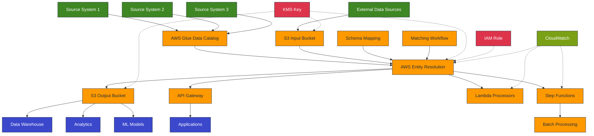

# AWS Entity Resolution: Technical Architecture

## Overview

This document outlines the proposed technical architecture for implementing AWS Entity
Resolution within our organization. The architecture is designed to be scalable, secure,
and integrated with our existing data ecosystem while providing the flexibility to
support multiple business use cases.

## Architecture Diagram

## Component Details

### Data Sources

1. **Internal Systems**

   - CRM systems
   - Transaction processing systems
   - Customer service platforms
   - Marketing automation tools
   - Product management systems

1. **AWS Glue Data Catalog**[¹](#references)

   - Centralized metadata repository
   - Maintains table definitions and schema information
   - Acts as the primary data source for AWS Entity Resolution

1. **S3 Input Bucket**

   - Storage for batch data files
   - Supports encrypted data ingestion
   - Used for external data provider feeds

### Core Entity Resolution Components

1. **Schema Mapping**[²](#references)

   - Define data schemas for each source system
   - Map source fields to standard entity attributes
   - Configure data normalization rules
   - Support for custom transformation logic

1. **Matching Workflows**[²](#references)

   - Rule-based matching configurations
   - ML-based matching for complex scenarios
   - Provider-led matching for external data enrichment
   - Configuration for match threshold settings

1. **Processing Models**[²](#references)

   - Batch processing for large datasets
   - Incremental processing for new records
   - Real-time lookups via API

1. **S3 Output Bucket**

   - Stores match results with unique identifiers
   - Maintains resolution history
   - Supports encrypted storage of matched data

### Integration Components

1. **API Gateway**[³](#references)

   - Provides RESTful interface for real-time resolution
   - Supports authenticated access from applications
   - Enables GetMatchId functionality

1. **Lambda Functions**[⁴](#references)

   - Pre-processing data transformation
   - Post-processing result enrichment
   - Custom matching rule execution
   - Integration with downstream systems

1. **Step Functions**[⁵](#references)

   - Orchestrates end-to-end matching workflows
   - Coordinates batch processing jobs
   - Handles error conditions and retries
   - Triggers notifications on completion

### Security Components

1. **KMS Key Management**[⁶](#references)

   - Centralized encryption key management
   - Encryption of data at rest and in transit
   - Key rotation and access controls

1. **IAM Roles and Policies**[⁷](#references)

   - Least-privilege access model
   - Service role for Entity Resolution
   - Data access policies for input/output buckets
   - API authentication and authorization

1. **Data Protection Features**[²](#references)

   - Support for hashed PII data
   - Regional data processing
   - Audit logging of all resolution activities

### Monitoring and Observability

1. **CloudWatch Integration**[⁸](#references)

   - Operational metrics collection
   - Performance monitoring
   - Alerting on error conditions
   - Log aggregation and analysis

1. **Custom Dashboards**

   - Match quality metrics
   - Processing volume trends
   - Error rate monitoring
   - Data quality indicators

## Data Flow

### Batch Resolution Process

1. Source systems export data to AWS Glue tables or S3 buckets
1. AWS Entity Resolution reads data using configured schema mappings
1. Matching workflows execute based on defined rules or ML models
1. Match results are written to S3 output bucket with unique match IDs
1. Downstream systems consume match results for business processes

### Real-time Resolution Process

1. Application sends entity attributes via API call
1. AWS Entity Resolution applies normalization and matching rules
1. Service returns match ID if entity matches existing records
1. Application uses match ID to retrieve or update entity information
1. CloudWatch logs and metrics capture resolution activity

## Implementation Considerations

### Data Preparation

- Consistent primary keys across source systems
- Data quality assessment and remediation
- Normalization of key attributes (names, addresses, etc.)
- Handling of missing or incomplete data

### Performance Optimization

- Partitioning large datasets for parallel processing
- Incremental processing for high-volume sources
- Strategic use of real-time vs. batch resolution
- Caching strategies for frequently resolved entities

### Integration Strategy

- Initial bulk matching for historical data
- Incremental updates for ongoing changes
- Event-driven resolution for real-time use cases
- Feedback loops for match quality improvement

## Use Case Implementations

### Customer 360 View

Objective: Create unified customer profiles across all business units

Components:

- Customer data from CRM, transaction systems, and marketing platforms
- Rule-based matching on customer identifiers
- ML-based matching for complex scenarios
- API integration with customer-facing applications

### Product Data Harmonization

Objective: Reconcile product information across supply chain and sales systems

Components:

- Product data from ERP, inventory, and e-commerce systems
- Rule-based matching on product identifiers (SKU, UPC, etc.)
- Incremental processing for catalog updates
- Integration with product information management systems

### Compliance and Risk Management

Objective: Improve entity identification for regulatory compliance

Components:

- Customer data with enhanced KYC attributes
- Third-party data integration for verification
- High-precision matching rules for legal entities
- Integration with risk assessment systems

## Scalability and High Availability

- AWS Entity Resolution is a managed service with built-in scalability[⁹](#references)
- Multi-AZ deployment for high availability
- Automatic scaling based on workload
- No infrastructure management required

## Cost Optimization

- Pay-per-use pricing model[¹⁰](#references)
- Optimize batch processing schedules
- Use incremental processing where possible
- Monitor and adjust real-time API usage

## Implementation Roadmap

### Phase 1: Foundation (1-3 months)

- Establish AWS Entity Resolution infrastructure
- Configure security controls and access policies
- Implement initial schema mappings for primary data sources
- Develop and test basic matching workflows

### Phase 2: Core Use Cases (3-6 months)

- Implement Customer 360 use case
- Integrate with key operational systems
- Establish monitoring and quality metrics
- Refine matching rules based on feedback

### Phase 3: Advanced Capabilities (6-12 months)

- Implement additional use cases
- Deploy ML-based matching for complex scenarios
- Develop real-time resolution capabilities
- Integrate with analytics and data science platforms

## Conclusion

The proposed AWS Entity Resolution architecture provides a scalable, secure, and
flexible foundation for resolving entity data across our organization. By leveraging the
managed service capabilities of AWS, we can implement entity resolution with minimal
infrastructure management while achieving high performance and reliability.

This architecture supports our key use cases while providing a path for future expansion
and enhancement of our entity resolution capabilities.

## References

1. [AWS Glue Data Catalog Documentation](https://docs.aws.amazon.com/glue/latest/dg/catalog-and-crawler.html)
1. [AWS Entity Resolution Features](https://docs.aws.amazon.com/entityresolution/latest/userguide/what-is-service.html)
1. [Amazon API Gateway Documentation](https://docs.aws.amazon.com/apigateway/latest/developerguide/welcome.html)
1. [AWS Lambda Documentation](https://docs.aws.amazon.com/lambda/latest/dg/welcome.html)
1. [AWS Step Functions Documentation](https://docs.aws.amazon.com/step-functions/latest/dg/welcome.html)
1. [AWS KMS Documentation](https://docs.aws.amazon.com/kms/latest/developerguide/overview.html)
1. [AWS IAM Documentation](https://docs.aws.amazon.com/IAM/latest/UserGuide/introduction.html)
1. [Amazon CloudWatch Documentation](https://docs.aws.amazon.com/AmazonCloudWatch/latest/monitoring/WhatIsCloudWatch.html)
1. [AWS Entity Resolution Serverless Blog](https://aws.amazon.com/blogs/industries/how-to-build-serverless-entity-resolution-workflows-on-aws/)
1. [AWS Entity Resolution Pricing](https://aws.amazon.com/entity-resolution/pricing/)
