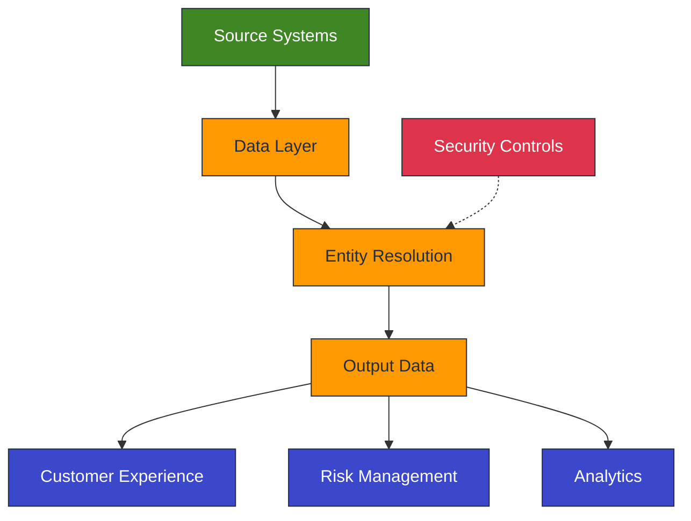

# Entity Resolution: Transforming Data into Strategic Value

## Slide 1: Executive Overview

**Entity Resolution: Building a Unified View of Your Data**

- **Challenge**: Fragmented data across multiple systems hinders business performance
- **Solution**: Entity resolution creates unified, accurate views of customers,
  products, and other entities
- **Impact**: Improved customer experience, operational efficiency, risk management, and
  revenue growth

______________________________________________________________________

## Slide 2: Business Challenges

**Why Entity Resolution Matters**

- 15-20% of customer records are duplicates or inconsistent¹
- Customer data is fragmented across 15+ systems
- Data stewards spend 30% of time manually resolving matching issues²
- Limited visibility into complete customer relationships
- Compliance risks from incomplete entity information
- Analytics constrained by disconnected data

______________________________________________________________________

## Slide 3: Strategic Value

**Aligning with Our Key Strategic Objectives**

| Strategic Objective    | Entity Resolution Contribution                                            |
| ---------------------- | ------------------------------------------------------------------------- |
| Customer-Centric Focus | Creates unified customer profiles enabling personalized experiences       |
| Operational Excellence | Reduces duplicate records and streamlines data processes                  |
| Risk Management        | Identifies hidden relationships and patterns for improved risk assessment |
| Data-Driven Culture    | Establishes trusted foundation for analytics and AI initiatives           |
| Digital Transformation | Enables seamless omnichannel customer experiences                         |

______________________________________________________________________

## Slide 4: Business Outcomes

**Quantifiable Business Impact**

- **15-30%** reduction in duplicate customer records³
- **25-40%** improvement in marketing campaign effectiveness⁴
- **20-35%** reduction in customer onboarding time
- **15-25%** increase in cross-sell/upsell conversion rates
- **30-50%** reduction in false positives for fraud detection⁵

______________________________________________________________________

## Slide 5: Solution Comparison

**Entity Resolution Options**

| Solution                       | Key Strengths                                | Best For                                            |
| ------------------------------ | -------------------------------------------- | --------------------------------------------------- |
| **AWS Entity Resolution**      | Cloud-native, scalable, quick implementation | Organizations with AWS ecosystem, focused use cases |
| **Quantexa Entity Resolution** | Best-in-class accuracy, network analytics    | Complex matching scenarios, fraud/risk applications |
| **Informatica MDM**            | Comprehensive MDM capabilities, governance   | Enterprise-wide MDM requirements, multiple domains  |

______________________________________________________________________

## Slide 6: AWS Entity Resolution

**AWS Entity Resolution Highlights**

- **Technology**: Cloud-native service for matching and linking related records⁶
- **Key Features**:
  - Rule-based, ML-based, and provider-led matching
  - Real-time and batch processing options
  - Seamless integration with AWS ecosystem
- **Differentiators**:
  - Pay-per-use pricing model
  - Fastest implementation timeline
  - Strong security and privacy controls

______________________________________________________________________

## Slide 7: Quantexa Entity Resolution

**Quantexa Entity Resolution Highlights**

- **Technology**: Contextual intelligence platform with network analytics⁷
- **Key Features**:
  - 99% matching accuracy with contextual intelligence
  - Network visualization of entity relationships
  - Batch, streaming, and on-demand processing
- **Differentiators**:
  - Best-in-class matching accuracy
  - Advanced relationship analytics
  - Proven with tier-1 financial institutions

______________________________________________________________________

## Slide 8: Informatica MDM

**Informatica MDM Highlights**

- **Technology**: Comprehensive MDM suite with entity resolution capabilities⁸
- **Key Features**:
  - Multi-domain MDM approach
  - AI-powered match and merge
  - Built-in data governance
- **Differentiators**:
  - 360-degree view across multiple domains
  - Strong data governance capabilities
  - Extensive integration options

______________________________________________________________________

## Slide 9: ROI Analysis

**Financial Impact**

| Metric           | 5-Year Projection |
| ---------------- | ----------------- |
| Total Investment | $1.2M - $2.2M     |
| Total Benefits   | $4.2M - $7.7M     |
| Net Value        | $3.0M - $5.5M     |
| ROI              | 250% - 350%       |
| Payback Period   | 12 - 18 months    |

*Analysis based on industry benchmarks and organization-specific estimates⁹*

______________________________________________________________________

## Slide 10: Implementation Approach

**Phased Implementation Strategy**

**Phase 1: Foundation (3-6 months)**

- Select solution and establish infrastructure
- Implement core matching capabilities
- Pilot with high-value use case

**Phase 2: Expansion (6-12 months)**

- Extend to additional data domains
- Integrate with key operational systems
- Develop enhanced analytics capabilities

**Phase 3: Optimization (12-18 months)**

- Implement advanced matching capabilities
- Enable real-time resolution
- Expand to additional use cases

______________________________________________________________________

## Slide 11: Use Cases

**Priority Use Cases**

1. **Customer 360 View**

   - Unified customer profiles across business units
   - Enhanced customer service and personalization
   - Improved marketing effectiveness

1. **Product Data Harmonization**

   - Reconciled product information across systems
   - Improved inventory management
   - Enhanced e-commerce capabilities

1. **Risk and Compliance**

   - Better entity identification for KYC/AML
   - Improved fraud detection
   - Enhanced regulatory reporting

______________________________________________________________________

## Slide 12: Architecture Overview

______________________________________________________________________

## Slide 13: Implementation Timeline

**Key Milestones**

| Milestone           | Timeline    | Deliverables                                |
| ------------------- | ----------- | ------------------------------------------- |
| Solution Selection  | Month 1-2   | Vendor selected, contracts finalized        |
| Initial Setup       | Month 2-3   | Core infrastructure established             |
| First Use Case      | Month 3-6   | Pilot implementation for Customer 360       |
| Expanded Deployment | Month 6-12  | Additional use cases, system integrations   |
| Optimization        | Month 12-18 | Advanced capabilities, real-time processing |

______________________________________________________________________

## Slide 14: Critical Success Factors

**Keys to Success**

1. **Executive Sponsorship**

   - Active engagement from senior leadership
   - Clear ownership of outcomes

1. **Data Governance**

   - Established data stewardship processes
   - Quality metrics and monitoring

1. **Change Management**

   - Comprehensive training program
   - Process redesign aligned with new capabilities

1. **Phased Implementation**

   - Focus on high-value use cases first
   - Measure and communicate results

______________________________________________________________________

## Slide 15: Recommendation and Next Steps

**Strategic Recommendation**

Based on our analysis, we recommend implementing **\[AWS Entity
Resolution/Quantexa/Informatica MDM\]** to address our entity resolution needs.

**Next Steps**

1. Approve business case and funding
1. Establish executive steering committee
1. Finalize vendor selection
1. Develop detailed implementation plan
1. Initiate Phase 1 implementation

______________________________________________________________________

## Slide 16: Q&A

**Thank You**

Questions and Discussion

______________________________________________________________________

## References

1. Experian Data Quality Research - State of Data Quality
1. Gartner Data Quality Market Guide
1. Forrester Total Economic Impact Studies
1. McKinsey & Company - The Value of Personalization
1. KPMG Fraud Management Survey
1. AWS Entity Resolution Documentation
1. Quantexa Entity Resolution Solutions
1. Informatica MDM Solutions
1. Forrester Wave: Master Data Management
