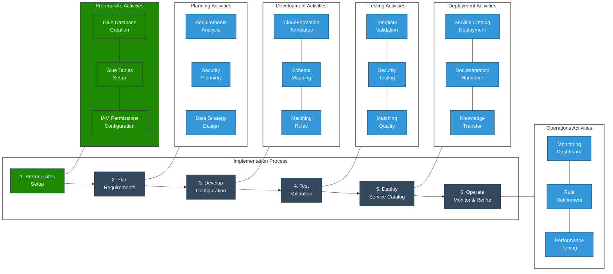

# AWS Entity Resolution - Implementation Guide

This guide provides a streamlined approach to implementing the AWS Entity Resolution
Service Catalog product.

## Implementation Workflow

## Prerequisites

Before implementing AWS Entity Resolution, ensure the following prerequisites are in
place:

### Glue Database and Tables

1. **Create AWS Glue Database**

   - Navigate to AWS Glue console
   - Create a new database to store table definitions
   - Use consistent naming conventions for easier management

1. **Configure Glue Tables**

   - Define tables that map to your source data
   - Ensure proper column definitions and data types
   - Verify table accessibility from Entity Resolution service

1. **Data Catalog Permissions**

   - Configure IAM permissions for Glue catalog access
   - Ensure Entity Resolution service can access the catalog

### IAM Permissions

1. **Service Role**

   - Create IAM role with permissions for:
     - AWS Entity Resolution service
     - AWS Glue Data Catalog access
     - S3 bucket read/write
     - KMS key usage

1. **User Permissions**

   - Grant appropriate permissions to users who will:
     - Deploy CloudFormation templates
     - Manage matching workflows
     - Access match results

### S3 Buckets

1. **Input Bucket**

   - Create S3 bucket for input data
   - Configure appropriate encryption settings

1. **Output Bucket**

   - Create S3 bucket for match results
   - Configure encryption and access policies

### KMS Keys

1. **Create KMS Key**
   - Create customer managed key for data encryption
   - Configure key policy with appropriate permissions
   - Enable automatic key rotation

## Deployment Checklist

### Step 1: Planning & Requirements

- [ ] Define entity matching requirements and success criteria
- [ ] Identify data sources and schema requirements
- [ ] Define security and compliance requirements
- [ ] Establish operational model and support requirements

### Step 2: Template Configuration

- [ ] Select appropriate Entity Resolution template from Service Catalog
- [ ] Configure CloudFormation parameters:
  - [ ] Input and output S3 bucket settings
  - [ ] KMS key configuration
  - [ ] IAM role settings
  - [ ] Matching workflow parameters

### Step 3: Schema Mapping

- [ ] Document source data schemas
- [ ] Create schema mapping configuration for each data source
- [ ] Validate schema mappings against sample data

### Step 4: Matching Configuration

- [ ] Define matching rules based on business requirements
- [ ] Configure rule-based or ML-based matching workflows
- [ ] Set match confidence thresholds
- [ ] Define output format requirements

### Step 5: Deployment

- [ ] Deploy CloudFormation stack through Service Catalog
- [ ] Validate resource creation and configuration
- [ ] Set up S3 bucket access policies
- [ ] Configure CloudWatch monitoring

### Step 6: Testing

- [ ] Perform data validation with sample datasets
- [ ] Test matching workflows with known match/non-match pairs
- [ ] Validate security controls
- [ ] Test error handling and recovery processes

### Step 7: Operations

- [ ] Establish monitoring dashboard
- [ ] Document operational procedures
- [ ] Create troubleshooting guide
- [ ] Define KPIs for measuring effectiveness

## Deployment Process

1. **Access Service Catalog**

   - Navigate to AWS Service Catalog in the AWS Console
   - Select the Entity Resolution product from the catalog

1. **Configure Parameters**

   - Specify input and output S3 bucket names
   - Configure KMS key for encryption
   - Define IAM role settings
   - Specify matching workflow configuration

1. **Launch Stack**

   - Review configuration parameters
   - Launch CloudFormation stack
   - Monitor stack creation progress

1. **Configure Entity Resolution**

   - Upload schema mapping configuration
   - Create matching workflow
   - Configure matching rules
   - Set up output configuration

1. **Test Workflow**

   - Upload test data to input S3 bucket
   - Execute matching workflow
   - Validate output results
   - Adjust configuration as needed

1. **Operational Handover**

   - Document deployment configuration
   - Create operational runbook
   - Train support personnel
   - Establish monitoring processes

## Best Practices

### Data Preparation

- Standardize data formats before ingestion
- Validate data quality and completeness
- Use consistent identifiers across datasets

### Security Configuration

- Use KMS CMK for all encryption
- Implement least privilege IAM roles
- Enable CloudTrail logging
- Configure S3 bucket policies

### Performance Optimization

- Split large datasets into smaller batches
- Configure appropriate timeout settings
- Use appropriate matching rule complexity
- Monitor workflow execution metrics

### Operational Excellence

- Create CloudWatch dashboards for monitoring
- Set up alerts for workflow failures
- Document troubleshooting procedures
- Implement regular rule refinement process

## Troubleshooting

| Issue                 | Potential Cause                 | Resolution                                               |
| --------------------- | ------------------------------- | -------------------------------------------------------- |
| KMS Access Denied     | Incorrect key policy            | Verify Entity Resolution service principal in key policy |
| Workflow Failure      | Data format mismatch            | Confirm data format matches schema configuration         |
| Missing Results       | S3 permissions issue            | Check S3 permissions and bucket encryption settings      |
| Performance Issues    | Dataset too large               | Evaluate data volume and workflow configuration          |
| Schema Mapping Errors | Incorrect field mappings        | Validate schema mapping against actual data format       |
| Match Quality Issues  | Rules too strict or too lenient | Adjust matching rules based on test results              |
| Resource Provisioning | CloudFormation template error   | Check CloudFormation template for syntax errors          |
| Timeout Errors        | Processing exceeds time limit   | Split data into smaller batches or adjust timeout        |
