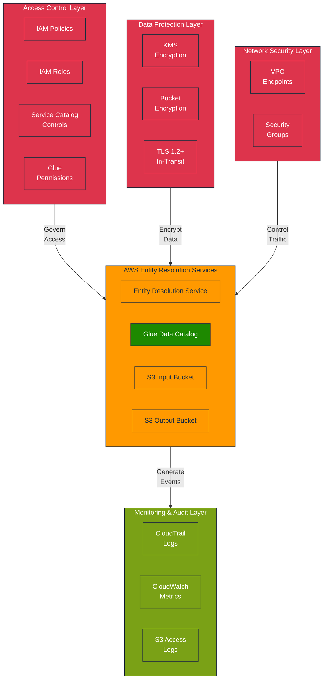

# AWS Entity Resolution - Security Guide

This document outlines the security controls required for the AWS Entity Resolution
Service Catalog product.

## Security Architecture Overview



## Security Control Matrix

| Domain              | Control               | Implementation                          | Validation Method                       |
| ------------------- | --------------------- | --------------------------------------- | --------------------------------------- |
| **Access Control**  | Identity Management   | IAM roles with least privilege          | IAM Access Analyzer                     |
|                     | Service Access        | Service Catalog permissions             | IAM policy review                       |
|                     | Resource Access       | Resource-based policies                 | S3 bucket policy audit                  |
|                     | Data Catalog Access   | Glue Data Catalog permissions           | Glue permissions review                 |
| **Data Protection** | Encryption at Rest    | KMS with Customer Managed Key           | Bucket encryption setting verification  |
|                     | Encryption in Transit | TLS 1.2+ for all communications         | TLS configuration validation            |
|                     | Key Management        | Automatic key rotation                  | KMS key configuration audit             |
|                     | Metadata Protection   | Glue table-level permissions            | Glue resource policy validation         |
| **Network**         | Network Isolation     | VPC Endpoints for AWS services          | VPC configuration review                |
|                     | Traffic Control       | Security Groups and NACLs               | Security Group rule validation          |
| **Logging**         | API Activity          | CloudTrail for all API calls            | CloudTrail configuration check          |
|                     | Data Access           | S3 Access Logs                          | Bucket logging configuration validation |
|                     | Service Activity      | CloudWatch Logs for Entity Resolution   | Log group existence verification        |
|                     | Catalog Activity      | CloudTrail for Glue operations          | Glue CloudTrail event verification      |
| **Compliance**      | Data Classification   | Resource tagging for sensitivity levels | Tag policy validation                   |
|                     | Retention Policy      | S3 lifecycle configuration              | Bucket lifecycle policy review          |

## Required IAM Permissions

### Entity Resolution Service Role

```yaml
# Entity Resolution Service Role Policy
{
  "Version": "2012-10-17",
  "Statement": [
    {
      "Effect": "Allow",
      "Action": [
        "s3:GetObject",
        "s3:ListBucket"
      ],
      "Resource": [
        "arn:aws:s3:::${InputBucketName}",
        "arn:aws:s3:::${InputBucketName}/*"
      ]
    },
    {
      "Effect": "Allow",
      "Action": [
        "s3:PutObject"
      ],
      "Resource": [
        "arn:aws:s3:::${OutputBucketName}",
        "arn:aws:s3:::${OutputBucketName}/*"
      ]
    },
    {
      "Effect": "Allow",
      "Action": [
        "kms:Decrypt",
        "kms:GenerateDataKey"
      ],
      "Resource": "${KMSKeyArn}"
    },
    {
      "Effect": "Allow",
      "Action": [
        "logs:CreateLogGroup",
        "logs:CreateLogStream",
        "logs:PutLogEvents"
      ],
      "Resource": "arn:aws:logs:*:*:log-group:/aws/entityresolution/*"
    },
    {
      "Effect": "Allow",
      "Action": [
        "glue:GetDatabase",
        "glue:GetDatabases",
        "glue:GetTable",
        "glue:GetTables",
        "glue:GetPartition",
        "glue:GetPartitions",
        "glue:BatchGetPartition"
      ],
      "Resource": [
        "arn:aws:glue:*:*:catalog",
        "arn:aws:glue:*:*:database/${GlueDatabaseName}",
        "arn:aws:glue:*:*:table/${GlueDatabaseName}/*"
      ]
    }
  ]
}
```

## KMS Key Policy

The KMS key policy must include permissions for the Entity Resolution service:

```yaml
# Required KMS Key Policy for Entity Resolution
{
  "Sid": "Allow Entity Resolution Service",
  "Effect": "Allow",
  "Principal": {
    "Service": "entityresolution.amazonaws.com"
  },
  "Action": [
    "kms:Encrypt",
    "kms:Decrypt",
    "kms:ReEncrypt*",
    "kms:GenerateDataKey*",
    "kms:DescribeKey"
  ],
  "Resource": "*"
}
```

## S3 Bucket Security Configuration

### Input Bucket Policy

```yaml
# Recommended S3 Input Bucket Policy
{
  "Version": "2012-10-17",
  "Statement": [
    {
      "Sid": "DenyUnencryptedObjectUploads",
      "Effect": "Deny",
      "Principal": "*",
      "Action": "s3:PutObject",
      "Resource": "arn:aws:s3:::${InputBucketName}/*",
      "Condition": {
        "StringNotEquals": {
          "s3:x-amz-server-side-encryption": "aws:kms"
        }
      }
    },
    {
      "Sid": "DenyIncorrectKMSKey",
      "Effect": "Deny",
      "Principal": "*",
      "Action": "s3:PutObject",
      "Resource": "arn:aws:s3:::${InputBucketName}/*",
      "Condition": {
        "StringNotEquals": {
          "s3:x-amz-server-side-encryption-aws-kms-key-id": "${KMSKeyArn}"
        }
      }
    }
  ]
}
```

## Security Best Practices

### Data Protection

1. **Encryption Configuration**

   - Use KMS Customer Managed Keys for all encryption
   - Enable automatic key rotation
   - Implement strict key access policies

1. **Data Handling**

   - Classify data according to sensitivity
   - Implement appropriate retention policies
   - Enable versioning for critical data

### Access Management

1. **Role-Based Access**

   - Use IAM roles with least privilege principle
   - Implement Service Control Policies for organizational guardrails
   - Regularly review and audit permissions

1. **Service Catalog Permissions**

   - Restrict product deployment to authorized roles
   - Use Launch Constraints to enforce security controls
   - Implement portfolio sharing with appropriate permissions

### Network Security

1. **VPC Integration**

   - Use VPC Endpoints for AWS services
   - Implement security groups for traffic control
   - Configure Network ACLs for subnet-level security

1. **Endpoint Policies**

   - Restrict VPC Endpoint access to required services
   - Implement appropriate endpoint policies
   - Monitor VPC Endpoint usage

### Monitoring and Audit

1. **Logging Configuration**

   - Enable CloudTrail for all API activities
   - Configure S3 Access Logs for data access monitoring
   - Implement CloudWatch Logs for Entity Resolution service

1. **Alert Configuration**

   - Set up CloudWatch Alarms for suspicious activities
   - Configure notifications for security-related events
   - Implement automated remediation where appropriate

## Security Compliance Validation

| Compliance Requirement | Validation Method            | Frequency  |
| ---------------------- | ---------------------------- | ---------- |
| IAM Role Permissions   | IAM Access Analyzer          | Weekly     |
| Encryption Settings    | AWS Config Rules             | Continuous |
| Network Configuration  | VPC Flow Logs Analysis       | Daily      |
| API Activity Logging   | CloudTrail Log Validation    | Continuous |
| Resource Configuration | AWS Security Hub Checks      | Daily      |
| Policy Compliance      | AWS Config Conformance Packs | Continuous |
