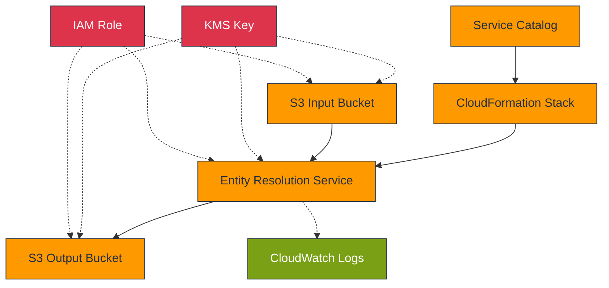
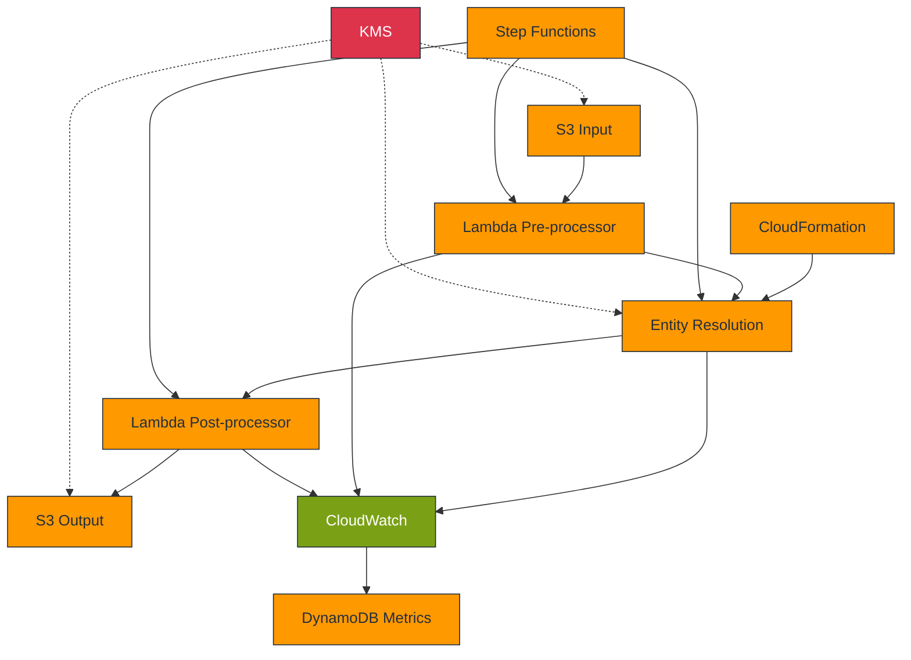

# AWS Entity Resolution - Technical Guide

This document provides the technical architecture and component details for the AWS
Entity Resolution Service Catalog product.

## Business Outcomes

| Outcome                     | Measure                   | Target        |
| --------------------------- | ------------------------- | ------------- |
| Accelerated Deployment      | Implementation time       | 70% reduction |
| Operational Standardization | Deviation from standards  | \<5%          |
| Governance Compliance       | Security control coverage | 100%          |
| Cost Optimization           | Development effort        | 60% reduction |

## Architecture Diagram

## Component Specifications

### Entity Resolution Service

- **Purpose**: Match and link records across datasets without sharing identifiers
- **Features**:
  - Rule-based or ML-based matching
  - Customizable matching workflows
  - Schema mapping for data standardization
- **Integrations**: S3, KMS, CloudWatch

### Infrastructure Components

| Component        | Type     | Purpose             | Configuration                   |
| ---------------- | -------- | ------------------- | ------------------------------- |
| S3 Input Bucket  | Storage  | Source data storage | Server-side encryption with KMS |
| S3 Output Bucket | Storage  | Results storage     | Server-side encryption with KMS |
| KMS Key          | Security | Data encryption     | Auto-rotation enabled           |
| IAM Role         | Security | Service permissions | Least privilege principle       |

## Data Flow

1. **Ingestion**: Customer data uploaded to S3 input bucket with KMS encryption
1. **Processing**: Entity Resolution service processes data using matching workflow
   - Data access requires KMS decryption
   - Matching performed using specified rules or ML
1. **Storage**: Results written to S3 output bucket with KMS encryption
1. **Access**: Results available for downstream analysis or application integration

## Technical Limitations

- Maximum individual file size: 1GB
- Supported formats: CSV, JSON
- Processing timeout: 24 hours per job
- Maximum matching rules per workflow: 15

## Enhanced Architecture for Advanced Use Cases

## Implementation Challenges and Solutions

| Challenge                  | Description                                       | Solution                                                                                           |
| -------------------------- | ------------------------------------------------- | -------------------------------------------------------------------------------------------------- |
| **Matching Flexibility**   | Rigid matching rules for varied real-world data   | Implement pre-processing Lambda for data standardization before matching                           |
| **Data Preparation**       | Strict formatting requirements                    | Create standard schema templates and validation processes for input data                           |
| **Result Quality**         | False positives and missed matches                | Start with strict rules, then adjust based on results analysis and feedback loops                  |
| **Operational Visibility** | Limited visibility into matching process          | Implement enhanced CloudWatch dashboards and custom metrics for match quality                      |
| **Throughput Constraints** | Processing limitations for large datasets         | Partition datasets into smaller batches and process in parallel workflows                          |
| **Integration Challenges** | Difficulty incorporating into existing data flows | Use Step Functions for orchestration with pre/post-processing Lambda functions                     |
| **Measuring Success**      | Hard to quantify value and match quality          | Establish baseline metrics before implementation and test with known datasets to evaluate accuracy |

## Recommended Enhancement Roadmap

For enterprise implementations, consider these enhancements beyond the base template:

1. **Pre/Post Processing**: Lambda functions for data standardization and results
   processing
1. **Quality Control**: Implement match confidence scoring and threshold filtering
1. **Workflow Orchestration**: Use Step Functions to create end-to-end matching
   pipelines
1. **Custom Monitoring**: Enhanced CloudWatch dashboards for match quality metrics
1. **Feedback Loop**: Process to capture false positives/negatives for rule refinement
