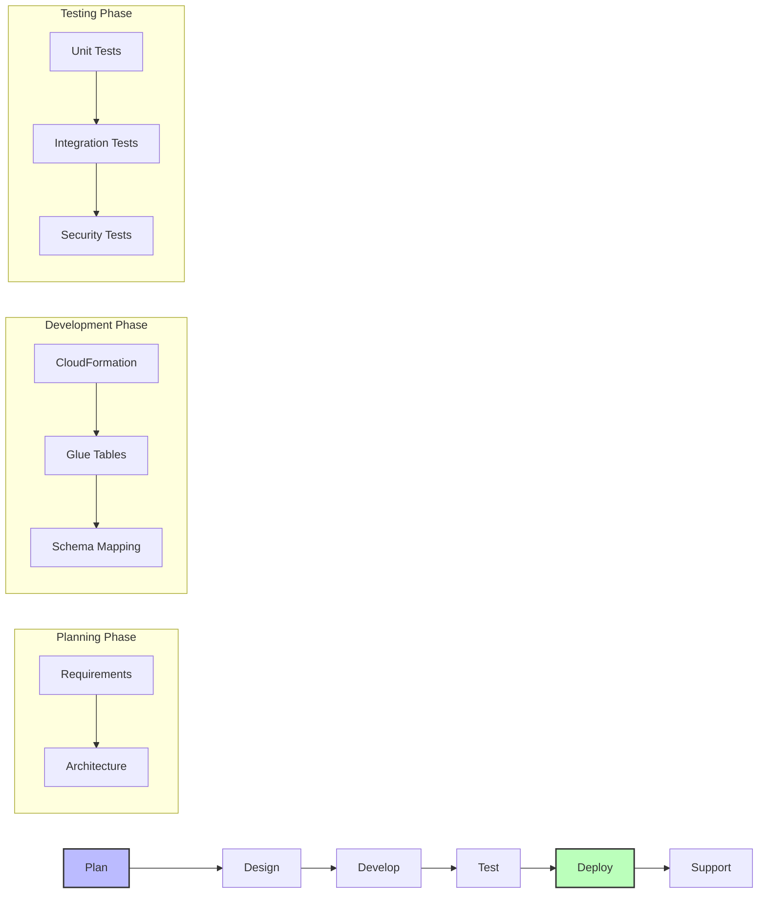

# AWS Entity Resolution - Implementation Guide

This guide provides a streamlined approach to implementing the AWS Entity Resolution Service Catalog product, including resource configuration details.

## Implementation Workflow



## Implementation Checklist

### 1. Planning & Requirements (1-2 Weeks)

- [ ] Define entity resolution use case and requirements
- [ ] Identify data sources and schema requirements
- [ ] Document security and compliance requirements
- [ ] Determine matching criteria and rules
- [ ] Plan S3 bucket structure and KMS key configuration
- [ ] Establish success metrics

### 2. CloudFormation Development (2-3 Weeks)

- [ ] Develop base CloudFormation template
- [ ] Define and configure KMS keys with appropriate permissions
- [ ] Define S3 buckets with encryption and lifecycle policies
- [ ] Define Glue database and table resources
- [ ] Create schema mapping templates
- [ ] Configure IAM roles with least privilege
- [ ] Set up CloudWatch monitoring

### 3. Testing & Validation (1-2 Weeks)

- [ ] Test template deployment
- [ ] Validate KMS key permissions
- [ ] Verify S3 bucket creation and encryption
- [ ] Validate Glue table creation
- [ ] Test entity resolution workflows
- [ ] Verify security controls
- [ ] Perform data validation

### 4. Deployment (1 Week)

- [ ] Publish to Service Catalog
- [ ] Create documentation for users
- [ ] Conduct knowledge transfer
- [ ] Set up support processes

## Resource Configuration Guide

### KMS Key Configuration

KMS keys are essential for encrypting your data. The Entity Resolution service needs access to these keys.

```yaml
DataEncryptionKey:
  Type: AWS::KMS::Key
  Properties:
    Description: "KMS key for encrypting Entity Resolution data"
    EnableKeyRotation: true
    KeyPolicy:
      Version: "2012-10-17"
      Statement:
        - Effect: Allow
          Principal:
            AWS: !Sub "arn:aws:iam::${AWS::AccountId}:root"
          Action: "kms:*"
          Resource: "*"
        - Effect: Allow
          Principal:
            Service: "entityresolution.amazonaws.com"
          Action:
            - "kms:Encrypt"
            - "kms:Decrypt"
            - "kms:ReEncrypt*"
            - "kms:GenerateDataKey*"
            - "kms:DescribeKey"
          Resource: "*"

DataEncryptionKeyAlias:
  Type: AWS::KMS::Alias
  Properties:
    AliasName: !Sub "alias/${AWS::StackName}-er-key"
    TargetKeyId: !Ref DataEncryptionKey
```

### S3 Bucket Configuration

S3 buckets store your source data and entity resolution results. Configure them with proper encryption and lifecycle policies.

```yaml
InputBucket:
  Type: AWS::S3::Bucket
  Properties:
    BucketEncryption:
      ServerSideEncryptionConfiguration:
        - ServerSideEncryptionByDefault:
            SSEAlgorithm: aws:kms
            KMSMasterKeyID: !GetAtt DataEncryptionKey.Arn
    LifecycleConfiguration:
      Rules:
        - Status: Enabled
          ExpirationInDays: 90
    PublicAccessBlockConfiguration:
      BlockPublicAcls: true
      BlockPublicPolicy: true
      IgnorePublicAcls: true
      RestrictPublicBuckets: true

OutputBucket:
  Type: AWS::S3::Bucket
  Properties:
    BucketEncryption:
      ServerSideEncryptionConfiguration:
        - ServerSideEncryptionByDefault:
            SSEAlgorithm: aws:kms
            KMSMasterKeyID: !GetAtt DataEncryptionKey.Arn
    PublicAccessBlockConfiguration:
      BlockPublicAcls: true
      BlockPublicPolicy: true
      IgnorePublicAcls: true
      RestrictPublicBuckets: true
```

### Glue Database and Table Configuration

Glue Tables are the primary data source for AWS Entity Resolution. Configure them to point to your S3 data locations.

```yaml
GlueDatabase:
  Type: AWS::Glue::Database
  Properties:
    CatalogId: !Ref AWS::AccountId
    DatabaseInput:
      Name: !Sub "${AWS::StackName}-database"
      Description: Database for Entity Resolution source data

CustomerTable:
  Type: AWS::Glue::Table
  Properties:
    CatalogId: !Ref AWS::AccountId
    DatabaseName: !Ref GlueDatabase
    TableInput:
      Name: customer_data
      StorageDescriptor:
        Location: !Sub "s3://${InputBucket}/customer-data/"
        InputFormat: org.apache.hadoop.mapred.TextInputFormat
        OutputFormat: org.apache.hadoop.hive.ql.io.HiveIgnoreKeyTextOutputFormat
        SerdeInfo:
          SerializationLibrary: org.apache.hadoop.hive.serde2.lazy.LazySimpleSerDe
          Parameters:
            'field.delim': ','
        Columns:
          - Name: customer_id
            Type: string
          - Name: first_name
            Type: string
          - Name: last_name
            Type: string
          - Name: email
            Type: string
          - Name: phone
            Type: string
```

### Entity Resolution Configuration

Configure the Entity Resolution workflow to match your specific needs:

```yaml
EntityResolutionWorkflow:
  Type: AWS::EntityResolution::MatchingWorkflow
  Properties:
    Description: "Customer matching workflow"
    InputSourceConfig:
      InputSourceARN: !GetAtt CustomerTable.TableArn
    OutputSourceConfig:
      OutputS3Path: !Sub "s3://${OutputBucket}/matching-results/"
      KMSArn: !GetAtt DataEncryptionKey.Arn
    RoleArn: !GetAtt EntityResolutionRole.Arn
    ResolutionTechniques:
      ResolutionType: "RULE_MATCHING"
      RuleBasedProperties:
        Rules:
          - MatchingKeys:
              - "email"
            Rule: "Exact"
          - MatchingKeys:
              - "first_name"
              - "last_name"
              - "phone"
            Rule: "Exact"
```

## Common Challenges & Solutions

| Challenge | Solution |
|-----------|----------|
| **Matching Quality Issues** | Refine schema mapping and matching rules; consider using weighted fields |
| **Performance with Large Data** | Use efficient schema design; batch processing when possible |
| **Security Compliance** | Follow IAM least privilege; encrypt all data with KMS; use VPC endpoints when needed |
| **Glue Table Issues** | Use proper data types; avoid partitioned tables; ensure S3 locations are accessible |
| **Integration Problems** | Test with representative datasets; document integration points clearly |

## Best Practices

1. **Schema Design**: Create clear, consistent schemas that map well to standard entity types
2. **Security**: Encrypt all data and implement proper access controls
3. **Monitoring**: Set up alerts for workflow failures and performance issues
4. **Testing**: Test with realistic data volumes and variety
5. **Documentation**: Document all schema mappings and matching rules for future reference

## Required Permissions

Users deploying this Service Catalog product need:

```
servicecatalog:ProvisionProduct
cloudformation:CreateStack
glue:CreateDatabase
glue:CreateTable
s3:CreateBucket
iam:PassRole
```

## Next Steps After Deployment

1. Verify CloudFormation stack created successfully
2. Confirm Glue tables are accessible to Entity Resolution
3. Test data upload and processing workflow
4. Monitor initial matching results and refine as needed 