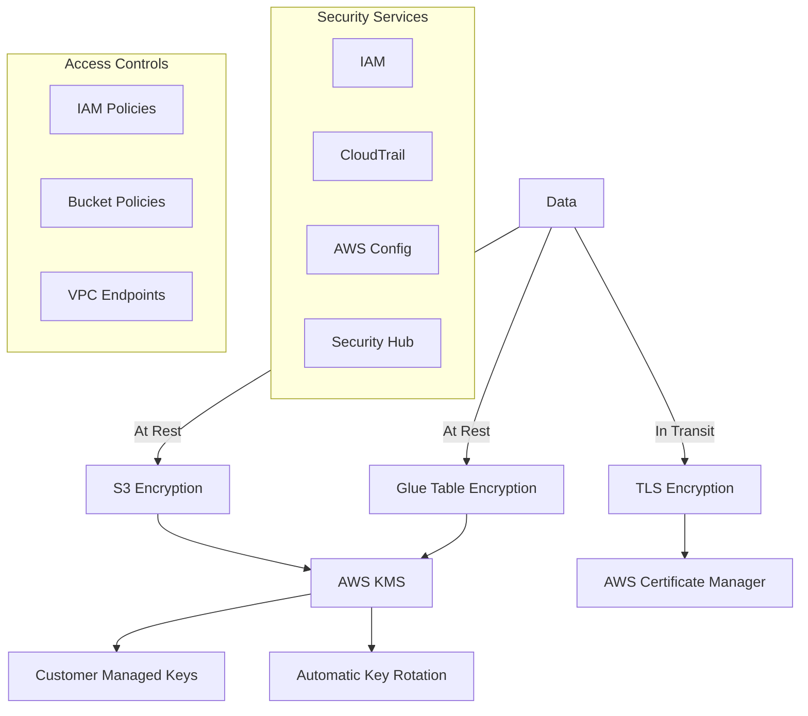

# AWS Entity Resolution - Security Guide

This document outlines the essential security considerations for implementing the AWS Entity Resolution Service Catalog product securely.

## Security Principles

The AWS Entity Resolution Service Catalog product is designed with these core security principles:

1. **Least Privilege**: All IAM roles and policies follow the principle of least privilege
2. **Defense in Depth**: Multiple security controls at different layers
3. **Encryption by Default**: All data encrypted at rest and in transit
4. **Auditability**: Comprehensive logging and monitoring
5. **Compliance by Design**: Security controls mapped to compliance requirements

## Data Security Framework



## Essential Security Controls

### 1. Data Encryption

* **KMS Keys**: Use customer-managed keys (CMK) with automatic rotation
* **S3 Encryption**: Enable server-side encryption with KMS for all buckets
* **Glue Table Encryption**: Enable encryption for the Glue Data Catalog
* **Key Policies**: Ensure the Entity Resolution service has access to your KMS keys

```yaml
# Example KMS key policy
KeyPolicy:
  Version: "2012-10-17"
  Statement:
    - Effect: Allow
      Principal:
        Service: "entityresolution.amazonaws.com"
      Action:
        - "kms:Encrypt"
        - "kms:Decrypt"
        - "kms:ReEncrypt*"
        - "kms:GenerateDataKey*"
        - "kms:DescribeKey"
      Resource: "*"
```

### 2. IAM Configuration

* **Service Role**: Create a dedicated role for the Entity Resolution service
* **Permission Boundaries**: Implement permission boundaries for all roles
* **Least Privilege**: Grant only the permissions needed for each component

```yaml
# Example IAM policy for Entity Resolution
EntityResolutionPolicy:
  Type: AWS::IAM::Policy
  Properties:
    PolicyName: EntityResolutionAccess
    Roles:
      - !Ref EntityResolutionRole
    PolicyDocument:
      Version: "2012-10-17"
      Statement:
        - Effect: Allow
          Action:
            - "glue:GetTable"
            - "glue:GetTables"
            - "glue:GetDatabase"
          Resource: "*"
        - Effect: Allow
          Action:
            - "s3:GetObject"
            - "s3:ListBucket"
            - "s3:PutObject"
          Resource:
            - !Sub "arn:aws:s3:::${InputBucket}"
            - !Sub "arn:aws:s3:::${InputBucket}/*"
            - !Sub "arn:aws:s3:::${OutputBucket}"
            - !Sub "arn:aws:s3:::${OutputBucket}/*"
```

### 3. Network Security

* **VPC Endpoints**: Use VPC endpoints for private access to AWS services
* **No Public Access**: Block public access to all S3 buckets
* **Secure Data Transfer**: Ensure TLS 1.2+ for all data in transit

### 4. Monitoring & Auditing

* **CloudTrail**: Enable CloudTrail for all API activity
* **CloudWatch Logs**: Configure detailed logging for Entity Resolution workflows
* **Alerts**: Set up alerts for security-related events
* **AWS Config**: Use AWS Config rules to ensure compliance

## Compliance Considerations

| Compliance Domain | Controls |
|-------------------|----------|
| **Data Privacy** | Encryption, access controls, audit logging |
| **Data Residency** | Region-specific deployments, resource policies |
| **Access Control** | IAM policies, bucket policies, KMS key policies |
| **Monitoring** | CloudTrail, CloudWatch, AWS Config |
| **Data Lifecycle** | S3 lifecycle policies, data cataloging |

## Security Best Practices

1. **Key Rotation**: Enable automatic key rotation for all KMS keys
2. **Regular Audits**: Review access patterns and permissions regularly
3. **Secrets Management**: Use AWS Secrets Manager for any credentials
4. **Data Classification**: Classify data according to sensitivity
5. **Least Privilege**: Grant minimum permissions needed
6. **Private Networking**: Use VPC endpoints when possible
7. **Monitoring**: Set up alerts for suspicious activity

## Security Implementation Checklist

- [ ] Configure KMS keys with automatic rotation
- [ ] Enable encryption for all S3 buckets
- [ ] Block public access to all S3 buckets
- [ ] Create IAM roles with least privilege
- [ ] Enable CloudTrail logging
- [ ] Set up CloudWatch alerts for security events
- [ ] Implement VPC endpoints for private AWS service access
- [ ] Document security controls for compliance

## Security Incident Response

1. **Detection**: Monitor CloudWatch alarms and logs
2. **Containment**: Isolate affected resources
3. **Eradication**: Remove unauthorized access
4. **Recovery**: Restore from secure backups if needed
5. **Lessons Learned**: Update security controls 