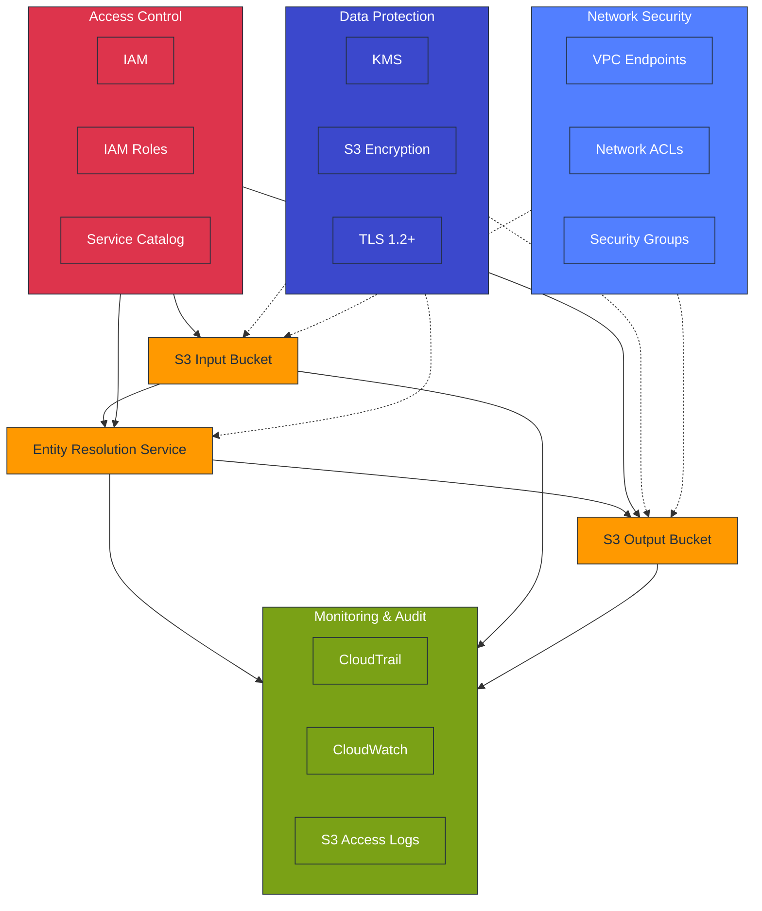

# AWS Entity Resolution - Security Controls

This document outlines the security controls required for the AWS Entity Resolution
Service Catalog product.

## Security Architecture Overview



## KMS Integration Requirements

AWS Entity Resolution requires KMS integration for cryptographic operations:

| Operation      | Purpose                   | Required Permission   |
| -------------- | ------------------------- | --------------------- |
| Decrypt        | Read source data from S3  | kms:Decrypt           |
| Encrypt        | Write results to S3       | kms:Encrypt           |
| Re-encrypt     | Data transformation       | kms:ReEncrypt\*       |
| Generate keys  | Temporary data processing | kms:GenerateDataKey\* |
| Key inspection | Key validation            | kms:DescribeKey       |

### KMS Key Policy Configuration

```yaml
Statement:
  - Sid: "AllowEntityResolutionService"
    Effect: Allow
    Principal:
      Service: "entityresolution.amazonaws.com"
    Action:
      - "kms:Encrypt"
      - "kms:Decrypt"
      - "kms:ReEncrypt*"
      - "kms:GenerateDataKey*"
      - "kms:DescribeKey"
    Resource: "*"
    Condition:
      StringEquals:
        "aws:SourceAccount": "${AWS::AccountId}"
```

## Data Security Controls

| Control         | Implementation                 | Verification            |
| --------------- | ------------------------------ | ----------------------- |
| Data at Rest    | KMS encryption of S3 buckets   | Confirm bucket policies |
| Data in Transit | TLS 1.2+                       | AWS service default     |
| Access Control  | IAM roles with least privilege | Review IAM permissions  |
| Key Rotation    | Automatic KMS key rotation     | Verify rotation setting |

## Security Best Practices

1. **Isolated Buckets**: Use dedicated S3 buckets for Entity Resolution
1. **VPC Endpoints**: Consider S3 VPC Endpoints for enhanced network security
1. **Access Logging**: Enable S3 access logging for audit trails
1. **IAM Boundaries**: Apply permission boundaries to Entity Resolution IAM roles
1. **Key Usage Monitoring**: Monitor KMS key usage through CloudTrail

## Addressing Security-Related Challenges

Based on customer feedback, this section addresses common security concerns while
maintaining a positive user experience:

### Simplifying Security Configuration

The most frequent customer complaint is complexity in security setup. To simplify while
maintaining security:

```yaml
# Template parameters for simplified security setup
Parameters:
  UseExistingKMSKey:
    Type: String
    Default: "No"
    AllowedValues:
      - "Yes"
      - "No"
    Description: "Use an existing KMS key (Yes) or create a new one (No)"

  ExistingKMSKeyArn:
    Type: String
    Default: ""
    Description: "If using an existing KMS key, provide the ARN"

Resources:
  # Conditional KMS key creation with pre-configured policy
  EntityResolutionKey:
    Type: AWS::KMS::Key
    Condition: CreateNewKey
    Properties:
      Description: "Auto-configured KMS key for Entity Resolution"
      EnableKeyRotation: true
      KeyPolicy: !If
        - UseDefaultPolicy
        - !Ref DefaultKMSPolicy
        - !Ref CustomKMSPolicy
```

### Balancing Security and Usability

| Challenge                  | User-Friendly Solution                                    |
| -------------------------- | --------------------------------------------------------- |
| **Complex Security Setup** | Pre-configured templates with secure defaults             |
| **Permissions Confusion**  | Use IAM managed policies with clear permission boundaries |
| **Audit Requirements**     | Automatically enable comprehensive logging                |
| **Data Privacy Concerns**  | Provide clear documentation on data handling practices    |

### Automated Security Validation

To prevent security-related deployment issues, implement automated validation:

```yaml
# CloudFormation custom resource for security validation
SecurityValidationFunction:
  Type: AWS::Lambda::Function
  Properties:
    Handler: index.handler
    Runtime: python3.8
    Code:
      ZipFile: |
        import boto3
        import cfnresponse

        def handler(event, context):
          if event['RequestType'] == 'Create' or event['RequestType'] == 'Update':
            try:
              # Validate KMS key permissions
              kms = boto3.client('kms')
              key_id = event['ResourceProperties']['KMSKeyId']
              policy = kms.get_key_policy(KeyId=key_id, PolicyName='default')

              # Check for Entity Resolution service in policy
              service_principal = "entityresolution.amazonaws.com"
              has_service = service_principal in str(policy)

              if not has_service:
                cfnresponse.send(event, context, cfnresponse.FAILED,
                  {"Message": "KMS key policy missing Entity Resolution service principal"})
                return

              # Other validations...
              cfnresponse.send(event, context, cfnresponse.SUCCESS,
                {"Message": "Security validation successful"})
            except Exception as e:
              cfnresponse.send(event, context, cfnresponse.FAILED,
                {"Message": f"Security validation failed: {str(e)}"})
          else:
            cfnresponse.send(event, context, cfnresponse.SUCCESS,
              {"Message": "Nothing to validate on delete"})
```

### Security Verification Checklist

For a smooth customer experience, provide this verification checklist:

```bash
# Simplified security verification script
#!/bin/bash
echo "Entity Resolution Security Verification"
echo "======================================="

# Check KMS key configuration
echo "Checking KMS key permissions..."
aws kms get-key-policy --key-id $KMS_KEY_ID --policy-name default --output text | \
  grep "entityresolution.amazonaws.com" > /dev/null
if [ $? -eq 0 ]; then
  echo "✓ KMS key correctly configured for Entity Resolution"
else
  echo "✗ KMS key missing Entity Resolution service principal"
fi

# Check S3 bucket encryption
echo "Checking S3 bucket encryption..."
aws s3api get-bucket-encryption --bucket $INPUT_BUCKET > /dev/null 2>&1
if [ $? -eq 0 ]; then
  echo "✓ Input bucket encryption enabled"
else
  echo "✗ Input bucket missing encryption configuration"
fi

# Additional checks...
```

## Security Validation

After deployment, verify security controls with this validation checklist:

- [ ] KMS key policy includes Entity Resolution service principal
- [ ] S3 buckets configured with server-side encryption using KMS
- [ ] IAM roles follow least privilege principle
- [ ] CloudTrail logging enabled for API activity monitoring
- [ ] S3 bucket policies prevent public access
