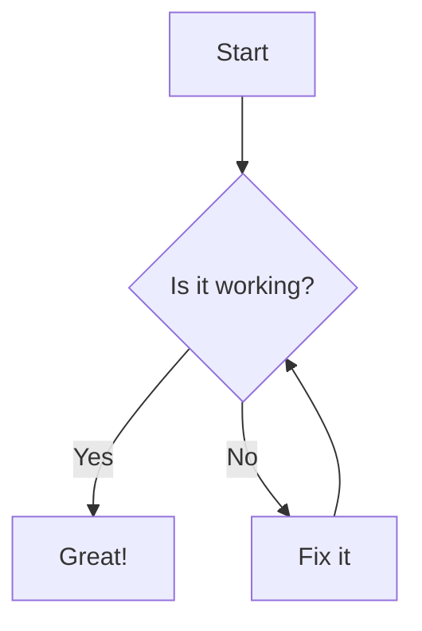

# Mermaid Diagram Test

## Valid Diagram

```mermaid
graph TD
    A[Start] --> B{Is it working?}
    B -->|Yes| C[Great!]
    B -->|No| D[Fix it]
    D --> B
```

## Invalid Diagram (Fixed closing bracket)

```mermaid
graph TD
    A[Start] --> B{Is it working?}
    B -->|Yes| C[Great!]
    B -->|No| D[Fix it]
    D --> B
```
