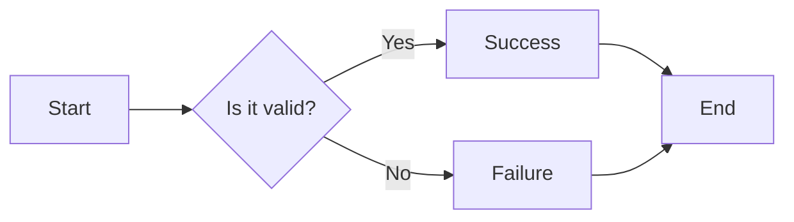

# Valid Mermaid Diagram Test

This file contains a valid Mermaid diagram.

```mermaid
flowchart LR
    A[Start] --> B{Is it valid?}
    B -->|Yes| C[Success]
    B -->|No| D[Failure]
    C --> E[End]
    D --> E
```
